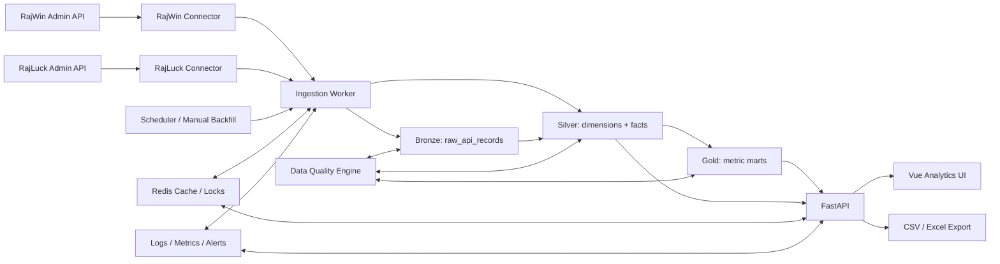
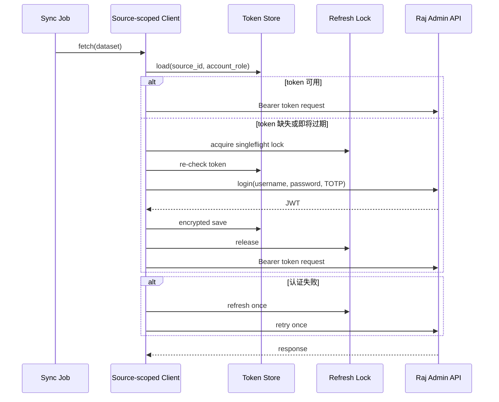
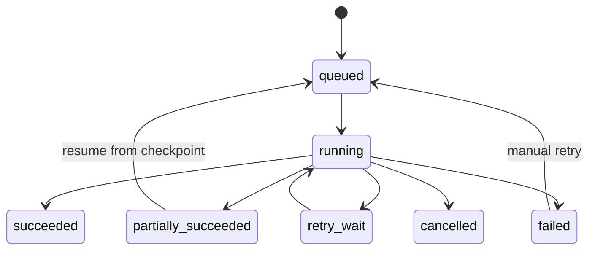
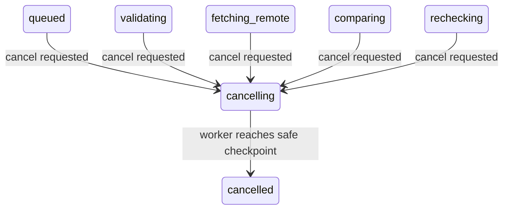

# Raj Data Handle 技术架构设计

> 文档状态：Draft v0.1
>
> 架构形态：模块化单体 + 独立采集 Worker
>
> 日期：2026-07-24

## 1. 架构原则

1. **来源是一等维度**：任何业务键都不能脱离 `source_id`。
2. **只读优先**：远端接口采用 Allowlist，MVP 禁止业务写操作。
3. **采集与查询解耦**：远端不可用不应导致已沉淀报表不可查询。
4. **原始数据可追溯**：保存脱敏请求摘要和原始响应，以便重放和排错。
5. **标准化后再分析**：JSONB 不是最终分析模型。
6. **幂等和可恢复**：任务重复运行、进程重启和分页失败均可安全恢复。
7. **单来源故障隔离**：认证、限流、熔断、任务和告警按来源隔离。
8. **口径可版本化**：指标公式、字段映射和渠道映射都有版本。
9. **最小化敏感数据**：不因接口返回了字段就默认全部持久化。

## 2. 总体架构



## 3. 建议技术栈

| 组件 | 建议选型 | 说明 |
|---|---|---|
| API | FastAPI + Pydantic | 与参考系统一致，适合类型化接口。 |
| ORM | SQLAlchemy 2.x async | 事务和仓储层清晰。 |
| 数据迁移 | Alembic | 版本化、可审计，不在生产手工改表。 |
| HTTP | httpx | 支持 TLS、超时、连接池和同步/异步。 |
| Worker | 独立 Python 进程 | 与 API 生命周期分离。 |
| 调度 | APScheduler | MVP 足够；任务锁和状态必须持久化。 |
| 数据库 | PostgreSQL | MVP 的原始层、事实层和指标层。 |
| 缓存 | Redis | 查询缓存、短时状态、分布式锁。 |
| 前端 | Vue 3 + TypeScript + Vite | 与参考系统一致。 |
| UI/图表 | Element Plus + ECharts | 表格、筛选、趋势和对比图。 |
| 部署 | Docker Compose + Nginx | 初期运维成本低。 |
| 监控 | Prometheus/OpenTelemetry + 结构化日志 | 统一任务与请求观测。 |

Python 版本建议在项目初始化时按依赖兼容性确定，不在需求阶段硬编码为某个未验证版本。

## 4. 建议项目结构

```text
raj_data_handle/
├── apps/
│   ├── api/                     # FastAPI 路由和依赖
│   ├── web/                     # Vue 前端
│   └── worker/                  # 调度、采集、补数、聚合
├── packages/
│   ├── connectors/
│   │   └── raj_admin/           # 远端认证、请求、端点适配
│   ├── ingestion/               # 分页、窗口、水位、任务运行
│   ├── warehouse/               # 原始层和标准化落库
│   ├── reconciliation/          # 代收/代付共用模板、匹配、复查和结果引擎
│   ├── metrics/                 # 指标定义、聚合与版本
│   ├── data_quality/            # 完整性、唯一性、对账、漂移
│   ├── domain/                  # 用户、系统设置权限、人工数据等领域服务
│   └── common/                  # 配置、数据库、日志、时间、加密
├── database/
│   └── migrations/
├── configs/
│   ├── sources.example.yml
│   └── metrics.example.yml
├── deploy/
├── tests/
│   ├── unit/
│   ├── contract/
│   ├── integration/
│   └── e2e/
└── docs/
```

## 5. 双数据源模型

### 5.1 配置模型

```yaml
sources:
  rajwin:
    display_name: RajWin
    backend_id: rajwin
    # base_url、enabled、business_timezone、currency 和凭据由管理员在系统配置页维护
    max_concurrency: 2
    requests_per_second: 2

  rajluck:
    display_name: RajLuck
    backend_id: rajluck
    # base_url、enabled、business_timezone、currency 和凭据由管理员在系统配置页维护
    max_concurrency: 2
    requests_per_second: 2
```

该文件只提供不可变默认项和运行限制。真实 URL、启用状态、业务时区、币种和凭据由
管理员在系统配置页维护；
用户名、密码、TOTP Secret 和 JWT 不进入配置文件、Git 或前端可读状态。

### 5.2 运行时隔离

每个来源独立拥有：

- `RemoteClient` 实例和 HTTP 连接池；
- 登录凭据引用；
- Token 状态和 Token 刷新锁；
- 请求限流器和熔断器；
- 数据集能力矩阵；
- 同步水位和检查点；
- 重试队列和连续失败计数；
- 字段映射和字典缓存；
- 健康状态及告警。

禁止使用一个全局 `base_url` 或一个共享 Token 文件在两个来源之间切换。
`source_id` 和账号角色都必须严格枚举；未知值或缺少配置时应 fail closed，
不得回退到默认来源或默认账号，以免把 RajLuck 请求误发给 RajWin。

### 5.2.1 来源配置与业务选择

管理员在系统配置页维护：

```text
source_id                  # 稳定且不可随意修改
display_name               # 盘口名，可修改
base_url
enabled
business_timezone
currency
credential_status          # 仅状态和更新时间，不含 Secret
request_limits
config_version
```

`business_timezone` 必须是 IANA TZDB 标识，不得只保存固定 UTC 偏移。新建 RajWin、
RajLuck 来源时预填 `Asia/Kolkata`（当前为 UTC+05:30），但需要管理员分别确认且允许
修改。`currency` 必须是 ISO 4217 大写三字母代码，新建来源时预填 `INR`，同样需要
管理员确认且允许修改。两者缺失或无效时只允许保存停用草稿，不得启用来源。

远端凭据在同一配置页以 write-only 字段录入：

```text
remote_username
remote_password
remote_totp_secret
```

后端将它们写入 `source_credentials` 的加密载荷，或写入 Secret Manager 后仅保存
`credential_secret_ref`。读取来源配置时只返回 `configured`、`updated_at`、
`last_tested_at` 和 `last_test_status` 等元数据，绝不返回明文、密文或可还原的掩码。
编辑时留空表示保留原值；替换必须明确提交新值。清除凭据使用单独的确认操作，避免误删。

新来源允许保存为停用草稿。启用来源，或者更换 base URL、账号、密码、TOTP Secret 后
重新启用前，必须执行完整的“测试连接”：

- URL 规范化和 HTTPS 校验；
- 禁止包含用户名、密码、Token、查询串和任意业务路径；
- DNS/TLS 探测；
- 用户名、密码、TOTP 登录和 Token 提取；
- 充值、提现渠道字典及小页只读接口探测。

测试由服务端执行，只返回脱敏的阶段状态和 `request_id`。测试 Token 不返回浏览器，
测试会话完成后立即销毁。测试失败的配置可继续以停用草稿保存，但不得启用，也不得
覆盖为“连接正常”。

业务页面通过 `GET /api/v1/sources?enabled=true` 加载可选盘口。每个比对批次只选择一个
`source_id`，然后加载该来源对应的渠道字典。批次保存 `source_id`、当时的显示名、
`business_timezone`、`currency` 和 `config_version`，但不复制凭据或 Token。
修改业务时区或币种必须递增 `config_version`，历史批次继续使用自己的快照。

建议的管理 API：

```text
GET    /api/v1/settings/sources
POST   /api/v1/settings/sources
PATCH  /api/v1/settings/sources/{source_id}
POST   /api/v1/settings/sources/{source_id}/test-connection
POST   /api/v1/settings/sources/{source_id}/disable
DELETE /api/v1/settings/sources/{source_id}/credentials
DELETE /api/v1/settings/sources/{source_id}
```

所有接口仅管理员可用；Secret 字段只允许写入。凭据替换或清除后立即删除该来源的缓存
Token、终止旧凭据刷新，并写入不含 Secret 内容的审计事件。

### 5.3 Connector 接口

```python
class RemoteConnector(Protocol):
    source_id: str

    async def authenticate(self) -> TokenState: ...
    async def probe(self) -> SourceHealth: ...
    async def fetch_page(
        self,
        dataset_key: str,
        *,
        window: TimeWindow | None,
        page: int,
        page_size: int,
        filters: dict[str, object],
    ) -> RemotePage: ...
    def normalize_response(
        self,
        dataset_key: str,
        payload: dict[str, object],
    ) -> NormalizedBatch: ...
    def classify_error(self, error: Exception) -> RemoteError: ...
```

业务代码只依赖 `dataset_key`，不拼接任意远端路径。

### 5.4 共用 Connector 实现

业务已确认 RajWin、RajLuck 运行同一套远端管理系统，接口路径、请求参数、响应结构和
前端页面一致。因此只实现一个 `RajAdminConnector`，分别创建两个来源作用域实例：

```text
RajAdminConnector(source_id="rajwin", source_config=...)
RajAdminConnector(source_id="rajluck", source_config=...)
```

以下内容共用：

- 端点注册表和请求参数编码；
- 认证、Token 提取和错误分类；
- 分页和响应包络解析；
- 字段标准化逻辑；
- 契约测试用例。

以下内容不得共用运行状态：

- base URL 和凭据；
- Token、刷新锁和 HTTP 连接池；
- 限流器、熔断状态和重试计数；
- 同步水位、检查点和任务队列；
- 原始数据、业务数据和数据质量结果。

共用接口契约不代表两个运行环境可以共享 Token 或业务键。部署版本也可能短暂不同，
因此发布时仍应对两个来源分别执行轻量契约探测。

## 6. 认证与 Token 生命周期



规则：

- Token 提前 60–120 秒视为即将过期；
- 认证失败最多刷新一次；
- 同一来源并发任务只允许一个刷新者；多进程部署时使用 Redis 或数据库分布式锁，
  不能只使用进程内线程锁；
- TOTP 在内存中即时生成，不持久化一次性验证码；
- 主机必须保持 NTP 正常；若 TOTP 窗口剩余时间过短，等待下一窗口后再登录；
- JWT `exp` 只用于刷新调度提示，不能代替远端认证结果或 JWT 验签；
- Token 只在服务端使用；
- Token 和凭据存储必须加密或由 Secret Manager 托管；
- 禁止在错误响应中包含登录 payload。

## 7. HTTP 请求策略

### 7.1 基础策略

- TLS 验证必须开启；
- connect/read/write/pool timeout 分开配置；
- 429、部分 5xx 和网络错误可重试，并尊重 `Retry-After`；
- 4xx 参数错误不自动重试；
- 只有端点注册表明确标记为幂等读取的请求才允许自动重试；
  即使 HTTP 方法为 POST，只读查询接口也需显式声明，远端写接口一律不重试；
- 指数退避 + 抖动，例如 1s、2s、4s；
- 每来源设置并发和 QPS；
- 请求必须携带内部 `request_id`、`sync_run_id`；
- 记录响应状态、耗时、字节数和脱敏摘要。

### 7.2 熔断

建议按 `source_id + endpoint_key` 统计：

- 连续 5 次可重试失败后进入 open；
- 30–60 秒后 half-open 探测；
- 认证失败单独告警，不与 5xx 混为一类；
- 一个 endpoint 熔断不自动停掉其他 endpoint；
- 数据源级登录失败可暂停该来源的新任务。

### 7.3 远端路径安全

端点注册表必须声明：

```text
endpoint_key
method
path
read_only
pagination_type
window_type
normalizer_version
capabilities
```

任何未登记路径都拒绝执行。不得提供“输入 URL 后代请求”的管理接口。

## 8. 采集与同步

### 8.1 同步状态机



### 8.2 任务键

任务去重键建议为：

```text
(source_id, dataset_key, window_start, window_end, run_mode)
```

一个活跃任务存在时，相同键的新任务应拒绝、合并或进入等待，不得并发重复抓取。

### 8.3 分页

本节适用于仍以 JSON 列表采集的端点、Token 探测和后续精确复查。当前充值、提现订单
明细缓存不在页面刷新时遍历分页，而是按来源业务时区导出完整自然日 Excel，在内存严格
校验白名单后再幂等写入本地；提现具体口径见
[提现订单 Excel 导出字段映射核对表](提现订单字段对照表.md)。

参考系统的远端分页上限为 100，虽然本地 API 页面允许更大的 `page_size`，
Connector 仍应将远端 `pageSize` 限制在已验证上限。

每页需要验证：

- 当前页和总页数；
- 总记录数；
- 空页是否早于最后一页；
- 业务键是否跨页重复；
- 页数是否在抓取过程中突变；
- 最后一页后是否仍返回数据。

对于抓取过程中不断变化的数据，应使用重叠时间窗口和幂等 Upsert，而不是假设分页快照稳定。

### 8.4 增量与回看

- 有可靠 `updated_at`：保存更新时间水位并保留重叠窗口；
- 只有业务日期：按日分片，滚动重拉 T、T-1、T-7；
- 留存/LTV：近期 Cohort 会持续变化，定期重算；
- 字典：每日全量覆盖，并保存版本；
- 历史回填：按天或小时分片，低优先级执行；
- 所有窗口都采用半开区间或明确的远端边界规则。

## 9. 数据分层

### 9.1 Bronze 原始层

核心表 `raw_api_records`：

| 字段 | 说明 |
|---|---|
| `id` | 内部主键 |
| `source_id` | RajWin/RajLuck |
| `dataset_key` | 数据集标识 |
| `sync_run_id` | 同步运行 |
| `request_id` | 请求关联 ID |
| `window_start/end` | 拉取窗口 |
| `page` | 页码 |
| `request_fingerprint` | 脱敏参数哈希 |
| `response_payload` | 原始 JSONB |
| `response_hash` | 内容哈希 |
| `schema_fingerprint` | 字段结构指纹 |
| `fetched_at` | UTC 抓取时间 |
| `expires_at` | 原始数据保留截止时间 |

原始层不保存密码、TOTP、Authorization Header。

### 9.2 Silver 标准化层

建议核心维度：

- `dim_source`
- `dim_date`
- `dim_channel`
- `dim_pay_channel`
- `dim_channel_type`
- `dim_game_vendor`
- `dim_game`
- `dim_user`（仅在批准用户级分析后）

建议核心事实：

- `fact_daily_channel`
- `fact_payment_channel_daily`
- `fact_first_pay_cohort`
- `fact_ltv_cohort`
- `fact_retention_cohort`
- `fact_charge_order`（首批 P0）
- `fact_withdraw_order`（首批 P0，仅保留比对所需字段）
- `fact_game_daily`（P1/P2）
- `fact_marketing_spend`

所有事实表至少包含：

```text
source_id
business_date
remote_business_key
source_updated_at
ingested_at
raw_record_id
normalizer_version
currency
```

唯一键示例：

```text
(source_id, remote_order_id)
(source_id, uid)
(source_id, business_date, remote_channel_code)
(source_id, cohort_date, remote_channel_code, retention_type)
```

### 9.3 Gold 指标层

- `mart_source_daily`
- `mart_channel_daily`
- `mart_payment_channel_daily`
- `mart_first_pay_cohort`
- `mart_ltv_cohort`
- `mart_retention_cohort`
- `mart_data_freshness`

Gold 表保存指标版本、生成时间和来源水位，便于解释页面数据。

## 10. 运行与质量表

- `source_systems`
- `source_endpoint_capabilities`
- `sync_jobs`
- `sync_runs`
- `sync_checkpoints`
- `sync_request_logs`
- `data_quality_rules`
- `data_quality_issues`
- `metric_definitions`
- `channel_mappings`
- `payment_platforms`
- `payment_template_versions`
- `payment_channel_bindings`
- `data_dictionary_entries`
- `time_calibration_profiles`
- `reconciliation_batch_channels`
- `manual_spend_revisions`
- `audit_logs`

`sync_runs` 必须记录：

```text
source_id, dataset_key, trigger_type, window, status,
started_at, finished_at, pages, fetched_rows, inserted_rows,
updated_rows, rejected_rows, retry_count, error_class, error_summary
```

## 11. 数据质量框架

### 11.1 规则类型

| 类型 | 示例 |
|---|---|
| 完整性 | 目标日期是否存在、分页是否完整。 |
| 唯一性 | 复合业务键是否重复。 |
| 有效性 | 金额、日期、状态、币种是否合法。 |
| 一致性 | 本地明细汇总与远端汇总差异。 |
| 新鲜度 | 最后成功时间是否超过 SLA。 |
| 连续性 | 指标相对历史是否异常突变。 |
| Schema 漂移 | 字段新增、缺失或类型变化。 |
| 字典漂移 | 未知渠道、状态、游戏、支付通道。 |

### 11.2 问题模型

```text
source_id
dataset_key
rule_code
severity
business_date
observed_value
expected_value
sample_reference
first_seen_at
last_seen_at
status
owner
resolution_note
```

## 12. 本地 API 设计

建议以 `/api/v1` 开始版本化：

```text
GET  /api/v1/sources
GET  /api/v1/sources/health
GET  /api/v1/dashboard/overview
GET  /api/v1/analytics/channels
GET  /api/v1/analytics/payment-channels
GET  /api/v1/analytics/first-pay
GET  /api/v1/analytics/ltv
GET  /api/v1/analytics/retention
GET  /api/v1/sync-runs
POST /api/v1/sync-runs/backfill
POST /api/v1/order-reconciliation/batches
GET  /api/v1/order-reconciliation/batches/{batch_id}
GET  /api/v1/order-reconciliation/batches/{batch_id}/results
POST /api/v1/order-reconciliation/batches/{batch_id}/exports
POST /api/v1/manual-spend/import
GET  /api/v1/data-quality/issues
POST /api/v1/exports
GET  /api/v1/exports/{export_id}
```

查询参数统一：

```text
source=rajwin|rajluck|all
start_date=YYYY-MM-DD
end_date=YYYY-MM-DD
channel=...
timezone=source|UTC
metric_version=...
```

`source=all` 不是去掉来源条件，而是在符合聚合规则后汇总并保留来源贡献。

## 13. 缓存

- 缓存键必须包含来源范围、日期、筛选和指标版本；
- 任务状态、Token 和查询缓存使用不同命名空间；
- Redis 不是分析数据的唯一真相来源；
- 新数据落库后按数据集和日期失效相关缓存；
- 敏感导出结果不进入共享缓存；
- 缓存不可掩盖数据过期状态。

## 14. 安全设计

### 14.1 远端安全

- 为两个后台申请专用只读账号；
- 接口方法和路径使用 Allowlist；
- 禁止审核、锁单、解锁、刷新订单等写接口；
- 出网限制到两个受信域名；
- 仅管理员可在系统设置中维护远端 base URL；业务页面和业务 API 禁止临时传入或覆盖；
- TLS 严格校验；
- 每来源限流，避免影响远端后台。

### 14.2 凭据安全

- 优先使用 Secret Manager；若 MVP 需要数据库承载动态凭据，则使用 AES-256-GCM
  信封加密，主密钥通过部署 Secret/KMS 注入且不得保存在同一数据库；
- 每条加密载荷使用独立随机 nonce，并绑定 `source_id` 和凭据版本作为附加认证数据；
- 数据库只保存 Secret 引用或密文、密钥版本、凭据版本和最后轮换时间；
- 配置读取 API 只返回 `configured`、更新时间和最近测试状态，禁止返回明文、密文或掩码；
- 管理员只能替换或明确清除凭据，不能查看已保存值；
- 凭据更新或清除后立即撤销该来源的缓存 JWT；
- 日志过滤 `password`、`code`、`totp`、`token`、`authorization`；
- JWT 加密保存并设置过期；
- “测试连接”只调用登录和 Allowlist 内的只读探测接口，测试会话完成后立即销毁；
- 凭据变更审计只记录来源、操作者、时间、动作和变更字段名，不记录值；
- 生产前进行凭据泄漏扫描。

参考审核系统的认证示例代码中存在硬编码敏感值和输出 Token 的风险。
新项目不得复制该示例；原参考代码中的硬编码值应立即移除，如曾实际使用则需要轮换对应凭据。
参考系统还存在明文凭据落盘和配置读取接口暴露敏感值的历史模式；
新系统不得移植这种设计，任何读取 API 都只能返回 Secret 元数据，不能返回 Secret 内容。

### 14.3 数据安全

- 默认不采集非分析必需的 PII；
- UID 对外展示可做部分掩码；
- IP、设备码、银行卡、手机号按列脱敏；
- 本模块不展示比对所需字段之外的远端 PII；
- 导出带操作者、水印、过期时间和审计；
- 数据保留周期按数据层配置。

### 14.4 本地用户认证

参考 `withdrawal_recheck_review` 的本地认证分层，但不跨仓库导入源码、不连接
`review_recheck`，也不复用其 JWT 签名密钥或会话。

建议数据表：

```text
app_users
auth_sessions
security_audit_logs
```

`app_users` 核心字段：

```text
id
username_normalized
username
password_hash
display_name
role                  # admin | user
is_active
password_changed_at
last_login_at
created_at
updated_at
```

`auth_sessions` 保存会话标识哈希、用户、创建时间、过期时间、撤销时间和必要的客户端
摘要。原始会话凭据不落库。

本地认证 API：

```text
GET    /api/v1/auth/captcha
POST   /api/v1/auth/login
GET    /api/v1/auth/me
POST   /api/v1/auth/logout
GET    /api/v1/auth/users
POST   /api/v1/auth/users
PATCH  /api/v1/auth/users/{user_id}
```

实现约束：

- 密码使用 bcrypt 或 Argon2id 强哈希，不保存或记录明文；
- 会话具有明确过期时间，默认值通过部署配置设置；
- 登录失败按 IP 和标准化用户名使用 Redis 共享限流，不能只使用进程内字典；
- 图形验证码可以沿用签名算术验证码思路，但密钥必须来自生产 Secret；
- 普通业务 API 只要求有效登录；批次查询不得隐式附加 `created_by=current_user`；
- 任一登录用户可查看、重新比对和导出任意未过期批次，实际操作者写入业务活动日志；
- 用户管理和系统设置 API 在后端统一要求 `role=admin`，不能只依赖前端隐藏菜单；
- 账号停用、角色变更、密码重置时撤销该账号已有会话；
- 禁止停用或降级最后一个有效管理员；
- 生产环境不得使用默认签名密钥；
- 前端可记住用户名，但不得保存明文密码；
- 登录、退出和用户管理写安全审计。

业务共享与系统权限边界：

```text
authenticated user:
  list/get all reconciliation batches
  view batch activity
  rerun any batch
  cancel any non-terminal batch
  create/download exports

admin only:
  manage users and roles
  manage source URLs and credentials
  publish global templates
  change retention/runtime settings
  view security audit
```

`created_by`、`rerun_requested_by`、`export_requested_by` 只用于筛选和审计，不作为
业务数据访问条件。文件及导出下载必须通过受认证 API 或短时单次签名地址，签发和
下载都记录用户、批次、文件、时间和结果；不得使用匿名永久对象地址。

首次管理员引导：

```text
scripts/create_admin_user.py
```

规则：

- 数据库迁移完成后执行；
- 默认只在不存在有效管理员时创建首个 `admin`；
- 用户名可以作为参数，密码通过隐藏交互、标准输入或受控 Secret 文件读取；
- 禁止使用 `--password <明文>`，避免密码进入进程列表和 Shell 历史；
- 校验密码强度，密码哈希后才写入数据库；
- 不在终端输出密码或密码哈希；
- 已存在有效管理员时默认拒绝再次执行；
- 创建成功写入来源为 `bootstrap_cli` 的安全审计；
- 后续用户通过管理员页面和 `/api/v1/auth/users` 管理。

参考系统中 JWT 有效期配置未真正写入 Token，前端还会把“记住的密码”写入
LocalStorage，登录限流也只在单进程内存中。新项目只参考其产品流程，不复制这些实现。

## 15. 可观测性

### 15.1 日志

统一字段：

```text
timestamp, level, service, source_id, dataset_key, sync_run_id,
request_id, endpoint_key, attempt, duration_ms, status, error_class
```

禁止记录完整响应中的敏感字段。原始响应进入受控原始层，不进入普通应用日志。

### 15.2 指标

- 请求次数、成功率、P50/P95/P99；
- 429、5xx、认证失败、解析失败；
- 同步延迟、处理量、重试、积压；
- Token 剩余有效时间；
- 数据新鲜度、缺数和对账差异；
- API 查询耗时和缓存命中率。

### 15.3 告警

- 来源登录连续失败；
- 关键数据集超过新鲜度 SLA；
- Schema 漂移；
- 分页总数不一致；
- 远端与本地对账超容差；
- Worker 停止心跳；
- 数据库或 Redis 不可用。

MVP 将这些运维告警展示在站内系统健康页并写入结构化日志，不发送邮件或 Telegram。
业务批次终态通知使用第 20.4 节的定向站内 `Alert`，两者不可混用。

## 16. 部署拓扑

MVP Compose 服务：

```text
nginx
web
api
worker
postgres
redis
```

生产建议：

- 分析数据库使用独立数据库和独立用户；
- 即使与其他系统共享 RDS 实例，也不得共享业务数据库；
- API 与 Worker 使用不同容器和健康检查；
- Worker 单实例起步，使用数据库锁防止重复调度；
- 备份包含数据库、指标配置、渠道映射和人工消耗；
- 原始层按保留策略归档或清理；
- 用户上传文件和系统生成的导出文件默认保留 72 小时；
- 比对批次及订单级结果默认保留 30 天；
- 远端充值订单原始响应及标准化缓存默认保留 30 天；
- 三类保留时间由管理员在系统配置页调整，创建时固化 `expires_at`，清理任务按记录过期时间执行；
- 远端订单缓存被新批次复用时更新最后引用时间并延长过期时间，活跃任务引用的数据不清理；
- 部署 SSH key 只用于主机运维，不用于远端业务 API 认证。

## 17. 测试策略

### 17.1 单元测试

- Token 解析和过期判断；
- 错误分类和重试；
- 日期窗口和时区；
- 分页边界和重复检测；
- 字段标准化；
- 指标公式和加权汇总；
- 脱敏器。

### 17.2 契约测试

每个数据源、每个端点保存匿名响应样例：

- 正常结果；
- 空结果；
- 多页结果；
- 认证失败；
- 业务失败；
- 5xx/429；
- 字段新增/缺失/类型变化。

契约测试必须同时在 RajWin 与 RajLuck 样例上执行。

### 17.3 集成测试

- 登录、Token 缓存和单飞刷新；
- 从原始层到事实表的完整链路；
- 重复任务幂等；
- 任务失败后检查点恢复；
- 单来源故障隔离；
- 数据对账和告警。

### 17.4 E2E

- 来源筛选；
- 日期和渠道筛选；
- 单平台/双平台切换；
- 补数、质量问题和导出；
- 普通用户修改系统设置时的权限阻断；
- 页面与导出一致。

## 18. 与当前审核系统的复用边界

可以复用的设计经验：

- 浏览器兼容请求头；
- JWT 提取和提前过期判断；
- TOTP 登录；
- 认证失败后单次重登；
- TLS、超时、重试和错误分类；
- 已验证的 endpoint 方法与参数形状；
- `pageSize <= 100` 的远端约束；
- Vue/FastAPI/PostgreSQL 的工程经验。

不应直接复制或耦合：

- 单一全局 base URL；
- 全局默认账号；
- 不带来源的 Token 文件名；
- 与复审数据库、压力模式、审核权限相关的依赖；
- 页面请求实时代理远端并顺手保存快照的模式；
- 本地明文凭据文件作为长期方案；
- 任何硬编码账号、密码、TOTP 或 Token 输出示例。

若希望多个项目共享连接器，应抽取版本化内部包 `raj-admin-client`，
由两个项目独立升级，并通过契约测试控制兼容性；不要使用相对路径跨仓库导入源码。

## 19. 演进路线

1. MVP：PostgreSQL + APScheduler，完成充值/提现订单遗漏比对和模板配置；
2. P1：经营统计报表、用户/游戏明细、更多质量对账；
3. P2：广告平台、审批式数据修订、指标配置中心；
4. 数据量验证后：将高体量投注明细迁移到 ClickHouse；
5. 任务规模增长后：将调度执行迁移到 Celery、Dramatiq 或消息队列体系。

任何演进都应保持 Connector、Ingestion、Warehouse、Reconciliation、Metrics
五层契约稳定。

## 20. 支付订单共用比对引擎

代收与代付使用一个 `ReconciliationEngine`，业务差异通过适配器提供：

```python
class OrderReconciliationAdapter(Protocol):
    business_type: str

    def allowed_remote_fields(self) -> set[str]: ...
    def validate_template(self, template: object) -> None: ...
    async def fetch_remote_page(self, request: object) -> object: ...
    async def recheck_by_order_keys(self, keys: object) -> object: ...
    def normalize_remote_order(self, row: object) -> object: ...
    def classify_remote_status(self, status: object) -> str: ...
```

首批实现：

```text
ChargeOrderReconciliationAdapter
WithdrawOrderReconciliationAdapter
```

共用能力：

- 文件模板检测和版本；
- 平台、渠道绑定和批次配置；
- 导入行指纹、完全重复合并和关键字段冲突分组；
- 标准字段映射及精确匹配规则；
- 分页完整性检查；
- 候选遗漏按订单号调用远端接口逐单精确复查，并对短暂失败执行有限重试；
- 精确复查失败、返回不完整或身份冲突时输出 `recheck_inconclusive`，禁止降级为确认遗漏；
- 结果状态、状态分组和顶部指标；
- 异步进度、导出、保留和审计。

适配器差异：

| 项目 | 代收/充值 | 代付/提现 |
|---|---|---|
| 当前日常缓存 | 完整自然日 Excel 导出 | 完整自然日 Excel 导出（`withdrawOrder/export`） |
| 列表接口用途 | Token 探测、精确复查、接口联调 | Token 探测、精确复查、接口联调 |
| 渠道字段 | `pay_method` | `pay_channel` / `pay_channel_name` |
| 标准事实表 | `fact_charge_order` | `fact_withdraw_order` |
| 特有字段 | 首充、通知状态 | 实付金额、回调状态、UTR |
| PII | 默认不采集 | 必须丢弃银行、姓名、手机号、IP |

比对引擎不得知道远端 URL、认证信息或原始 PII，只处理 Connector 和适配器返回的
标准化订单。

### 20.1 重复提交与重新比对

文件和业务执行使用两个不同的标识：

```text
file_content_key =
    sha256(file_bytes)

comparison_identity_key =
    sha256(
        file_content_key
        + source_id
        + business_type
        + payment_template_version_id
        + sorted(remote_channel_codes)
        + comparison_window
        + time_calibration_version
        + matching_rule_version
        + status_mapping_version
    )
```

`file_content_key` 用于内容寻址存储，同一文件只保留一份物理对象；每次上传或批次创建
生成独立文件引用和 `expires_at`，物理对象在不存在有效引用后才可清理。
`comparison_identity_key` 用于查找相同参数批次：

- 相同键存在活跃任务时，返回该批次，不创建并发重复任务；
- 相同键存在未过期的完成批次时，返回重复提示，由用户选择查看或重新比对；
- 用户选择重新比对时递增 `run_version`，并保存 `rerun_of_batch_id`；
- 重新比对复用文件及规范化支付导入快照，但强制重新拉取远端窗口、执行精确复查并
  写入新的结果快照；
- 技术性失败后的“继续执行”属于同一 `run_version` 的新 attempt；完成后由用户发起的
  “重新比对”才创建新 `run_version`。

同一执行版本使用 `UNIQUE (batch_id, order_group_id)` 防止重试产生重复结果。不同
`run_version` 的结果彼此独立，历史版本保留到各自的 `expires_at`。

### 20.2 批次取消

取消采用协作式状态机：



实现规则：

- `POST /api/v1/order-reconciliation/batches/{batch_id}/cancel` 对所有登录用户开放，
  请求包含可选原因，并记录实际操作者；
- API 以条件更新写入 `cancellation_requested_at`，重复请求返回当前状态，不创建重复事件；
- Worker 在远端分页之间、导入/比较分块之间、逐单复查之间和事务提交前检查取消标记；
- 已发出的单次只读请求允许正常结束，但取消后不再调度新请求；
- 结果写入事务和状态转换必须检查取消版本，避免取消与完成并发时发布最终结果；
- 取消后的批次保留进度、检查点和脱敏诊断，所有结果带 `is_final=false`；
- `cancelled` 批次不得生成确认遗漏业务导出，也不得计入业务汇总；
- `completed`、`failed`、`comparison_incomplete`、`cancelled` 等终态拒绝再次取消；
- 取消版本不能原地恢复；重新比对创建下一 `run_version`。

取消不需要撤销远端操作，因为 Connector 仅调用只读端点。取消批次及部分结果仍按该
批次既有 `expires_at` 清理。

### 20.3 币种与金额校验

系统级界面默认币种为 `INR`，但币种始终作为显式业务字段保存，不根据平台名或 URL
隐式推断：

```text
source_currency              # 盘口配置快照
payment_currency             # 文件列或用户确认
remote_amount
payment_amount
amount_check_status          # matched | mismatch | not_checked_currency_mismatch
amount_check_flag            # amount_unverified_currency_mismatch
```

规则：

- 文件有币种列时按模板逐行解析，没有时在批次确认页预填 `INR` 并要求用户确认；
- 任一纳入比较行的币种为空、无效或未知时，验证阶段失败并返回工作表及行号；
- `payment_currency == source_currency` 时使用定点小数执行金额一致性校验；
- 币种不同时仍执行精确订单号存在性、远端状态和遗漏复查，但
  `amount_check_status=not_checked_currency_mismatch`；
- 币种不同时不得产生 `amount_mismatch`，也不能把金额显示为已一致；
- 确认遗漏以订单标识和远端精确复查为依据，不因异币种退出统计，但结果必须显示
  “金额未校验”；
- MVP 不读取汇率、不换算金额、不跨币种汇总金额。

### 20.4 执行版本站内 Alert

每个执行版本固化通知接收人：

```text
execution_requested_by =
    initial run  -> batch.created_by
    rerun        -> rerun.requested_by
```

Worker 提交终态后，在同一数据库事务或可靠 outbox 中写入通知事件：

```text
user_notifications
    id
    user_id
    event_type                 # batch_completed | batch_failed |
                               # batch_incomplete | batch_cancelled
    batch_id
    run_version
    title
    summary_json               # 脱敏摘要
    created_at
    delivered_at
    read_at

UNIQUE (user_id, batch_id, run_version, event_type)
```

规则：

- 只为当前 `run_version.execution_requested_by` 创建通知；其他团队成员不弹窗；
- 通知不影响团队共享访问，所有登录用户仍可在批次列表看到终态；
- 在线前端可通过短轮询获取未读通知并显示站内 `Alert`；MVP 不要求 WebSocket；
- 登录成功和进入主页面时立即拉取未读通知，保证离线期间的终态下次能够补充弹出；
- 用户确认或关闭 Alert 后写入 `read_at`，重复轮询不重复弹出；
- 完成摘要可包含确认遗漏数、异常数和待复查数；失败摘要只返回脱敏错误分类和
  `request_id`，不得包含订单号、远端响应、凭据或 Token；
- MVP 不对接邮件、Telegram、短信、操作系统或浏览器原生通知。

建议 API：

```text
GET  /api/v1/notifications?unread=true
POST /api/v1/notifications/{notification_id}/read
POST /api/v1/notifications/read-all
```

### 20.5 结果图表与导出

图表、指标卡、明细列表和 Excel 汇总不得分别计算。API 使用同一个
`ReconciliationResultQuery` 和规范化筛选对象生成：

```text
summary_cards
result_status_distribution
payment_status_result_matrix
time_series
channel_comparison
detail_rows
export_rows
```

建议 API：

```text
GET  /api/v1/order-reconciliation/batches/{batch_id}/summary
GET  /api/v1/order-reconciliation/batches/{batch_id}/charts
GET  /api/v1/order-reconciliation/batches/{batch_id}/results
POST /api/v1/order-reconciliation/batches/{batch_id}/exports
```

三个 GET 接口接受同一组规范化筛选参数并返回 `filter_hash`、`aggregation_version` 和
`result_snapshot_version`。前端只负责可视化，不自行重算确认遗漏或比率。

结果页使用 ECharts 展示：

- 结果状态分布：按支付平台状态分段的横向堆叠柱状图，展示准确数量；
- 支付平台状态 × 比对结果：堆叠柱状图；
- 时间趋势：折线图，确认遗漏序列只统计支付平台成功状态；横轴使用批次确认的支付
  平台时间字段和时区；
- 渠道对比：分组柱状图；只有一个渠道时仍展示该渠道，不伪造对比。

图表点击事件转成同一筛选模型更新明细表。图表 tooltip 同时展示数量；涉及比率时显示
分子、分母和公式。取消或不完整批次的聚合响应返回 `is_final=false`，前端显示明显的
“非最终数据”提示，且不展示为确认遗漏结论。

默认 Excel 导出固定工作表：

```text
汇总
确认遗漏
远端状态异常
待复查
重复数据冲突
全部明细
```

“确认遗漏”工作表包含所有 `result_status=confirmed_missing` 记录并保留支付平台原始
状态，但汇总中的主确认遗漏数只统计支付平台成功状态。空分类仍生成带表头的工作表。
Excel 汇总使用与图表相同的服务端聚合结果；当前筛选
结果另可导出 UTF-8 CSV。导出任务保存 `filter_hash`、聚合版本、结果快照版本、发起人、
完成时间和文件过期时间。

共享批次列表另提供运行总览 API：

```text
GET /api/v1/order-reconciliation/operational-summary
```

其统计单位固定为 `batch_id + run_version`，只返回：

```text
execution_status_distribution
execution_created_time_series
execution_duration_buckets
failure_category_distribution
```

运行总览和批次列表共用盘口、业务类型、执行状态、创建人、日期及
`comparison_identity_key` 等筛选。重新比对版本作为独立执行计数，同时返回
`is_rerun=true`。

MVP 不在该接口返回跨批次订单数、金额、确认遗漏数或遗漏率。不同批次可能引用相同
文件、使用重叠窗口或属于同一执行系列，直接相加会重复。后续新增跨批次业务总览前，
必须版本化定义订单去重键、窗口归属、应选 `run_version` 和追溯修正规则。
