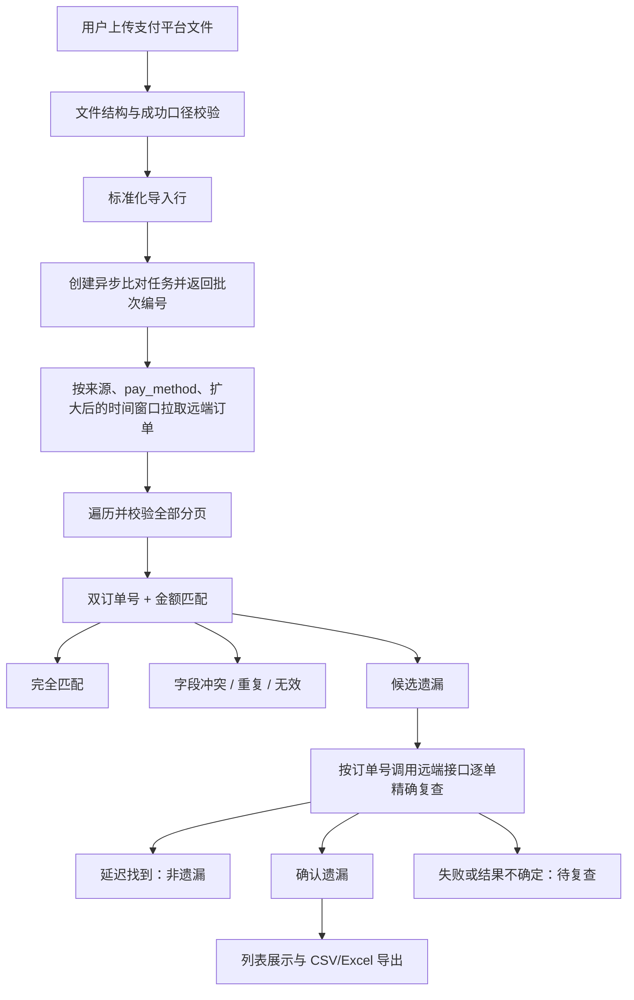

# 充值遗漏订单比对模块

> 文档状态：Draft v0.1
>
> 优先级：首个业务模块 / P0
>
> 日期：2026-07-24

## 1. 目标

将支付平台导出的充值/代收订单，与同来源、同支付渠道、同时间口径下的
远端管理后台充值订单进行比对，识别：

- 支付平台存在、远端也存在且关键字段一致的订单；
- 订单号存在但金额或另一订单号冲突的异常订单；
- 支付平台存在、远端初次未找到的候选遗漏订单；
- 经扩大窗口或精确查询复核后仍未找到的确认遗漏订单。

支付平台订单无论成功、失败、处理中或其他状态，只要必需字段有效，都进入比对。
平台原始状态在页面和导出中保留，并用于分组、筛选和风险提示。

确认遗漏订单支持页面查看以及 CSV/Excel 导出。本模块只读远端数据，不执行补单、
审核或任何订单修改。

已确认的设计决策：

- 不同支付平台使用独立、可版本化的导入模板；
- 时间列映射不固化在程序中，由登录用户在导入时确认或校准；
- 校准配置保存后可供同一支付平台的后续批次复用；
- 时间用于限定范围和辅助核验，不单独用于认定两条记录是同一订单。

## 2. 当前样本结论

### 2.1 数据来源

远端接口：

```text
GET /api/operate/chargeOrder/index
GET /api/operate/chargeOrder/summary
GET /api/operate/chargeOrder/payChannel
```

充值订单列表按 `pay_method` 过滤支付渠道。当前渠道字典样本已验证：

```text
pay_method=948 -> aelopay(HX)
```

支付平台文件：

```text
data/aelopay(HX)三方代收.xlsx
```

`elePay(HX)三方代付.xlsx` 属于代付/提现数据，不进入本模块。

### 2.2 已验证字段映射

| 支付平台字段 | 远端字段 | 用途 | 样本验证 |
|---|---|---|---|
| `商户订单号` | `order_num` | 主匹配键 | 4/4 精确一致 |
| `平台订单号` | `out_trade_no` | 交叉校验键 | 4/4 精确一致 |
| `订单金额` | `amount` | 金额校验 | 4/4 精确一致 |
| `订单状态=成功` | `status=1` | 成功口径候选 | 样本一致，正式枚举仍待确认 |
| `订单时间` | `create_time` | 创建时间候选 | 时区和窗口口径待确认 |
| `到账时间` | `pay_time` | 支付成功时间候选 | 时区和窗口口径待确认 |

当前远端订单样本只有第 1 页，共 205 页。因此样本只能验证字段映射，不能用于计算
真实遗漏数量。

## 3. 业务流程



## 4. 输入与批次

每次比对建立一个批次，至少包含：

```text
source_id
source_display_name
source_config_version
source_business_timezone
source_currency
payment_platform_id
payment_template_version_id
business_type                 # payin | payout
payment_channel_binding_ids[]
remote_channel_codes[]
comparison_timezone
payment_timezone
payment_currency_mode         # column | batch_default
payment_currencies[]
payment_time_field
remote_time_field
remote_query_time_field
fetch_buffer_before
fetch_buffer_after
calibration_version
window_start
window_end
uploaded_file_name
uploaded_file_sha256
uploaded_file_expires_at
comparison_identity_key
comparison_series_id
run_version
rerun_of_batch_id
execution_requested_by
result_expires_at
created_by                       # 仅审计和筛选，不作为访问条件
```

用户先从系统设置中已启用的盘口选择一个来源，再加载该来源的充值渠道字典。一个
批次只属于一个来源；同一文件如需分别与 RajWin、RajLuck 比对，应创建两个批次。
RajWin、RajLuck 的新建配置默认业务时区为 `Asia/Kolkata`，但批次始终使用并保存
管理员实际确认后的来源配置值，而不是依赖代码默认值。

批次确认后立即进入后台队列。API 快速返回 `batch_id`，后续文件解析、远端分页、
匹配和复查都由 Worker 执行。用户关闭页面不影响任务运行。

导入要求：

- MVP 支持 `.xlsx`，可同时支持 `.csv`；
- 第一行必须能识别必需字段；
- 订单号按字符串读取，禁止转换为浮点数或科学计数法；
- 金额转换为定点小数，禁止使用二进制浮点数参与相等判断；
- 文件有币种列时按模板逐行解析；没有时预填 `INR` 并由用户从 ISO 4217 字典中确认；
- 任一纳入比较行的币种未知、缺失或无效时阻止启动并返回工作表及行号；
- 文件哈希用于内容寻址和识别重复上传，同一内容只保存一个物理文件对象；
- 每个物理数据行保存工作表名称和原始行号；
- 对参与业务判断的全部规范化字段计算 `row_fingerprint`；
- 完全相同的指纹合并为一个规范订单组，只执行一次远端比对，同时保存全部原始行号；
- 任一非空订单标识相同但模板关键字段不一致时生成冲突组，不进入自动遗漏判定；
- 原文件和导出文件使用受控存储，默认自创建时间起保留 72 小时；
- 原文件中的真实订单信息不得写入普通应用日志。

文件和结果保留时间使用系统配置的当前默认值计算，并在创建时固化为各自的
`expires_at`。后续修改系统默认值不追溯修改已有文件或批次。

创建批次前，系统按文件哈希以及来源、业务类型、模板版本、渠道、时间窗口、时间校准、
匹配规则和状态映射生成 `comparison_identity_key`：

- 相同键存在活跃批次时直接返回该批次，不启动并发重复任务；
- 相同键存在未过期的完成批次时，提示查看已有结果或明确选择“重新比对”；
- 重新比对创建同一系列下递增的 `run_version`，复用支付文件和规范化导入快照；
- 新版本必须重新拉取远端订单并执行逐单精确复查，不复用旧版本的远端结论；
- 失败任务继续执行只增加 attempt，不创建新的 `run_version`。

## 5. 支付平台导入模板

支付平台名单在一定时期内相对稳定，但一个平台可能同时存在多个代收/代付文件格式
和多个远端支付渠道。因此拆分为三层：

```text
PaymentPlatform
  └── PaymentTemplateVersion[]
        └── PaymentChannelBinding[]
```

平台：

```text
platform_id
platform_key
display_name
active
```

模板版本：

```text
template_version_id
platform_id
business_type                  # payin | payout
version
effective_from
sheet_name_pattern
header_row_rule
header_signature
column_mapping
success_status_values
match_rules
active
created_by
published_by
```

`success_status_values` 用于识别和分组支付成功订单，不用于过滤其他状态订单。

远端渠道绑定：

```text
binding_id
platform_id
source_id                      # 内置 rajwin/rajluck 或管理员新增的稳定来源 ID
business_type                  # charge | withdraw
remote_channel_code            # charge 场景对应 pay_method
remote_channel_label
merchant_discriminator
effective_from
effective_to
active
```

同一平台在一个来源下可以有多个渠道绑定，在 RajWin、RajLuck 中也可以使用不同代码。
批次渠道选项来自所选来源的充值渠道字典。用户可以选择一个或多个渠道；模板只根据
平台名称提供推荐项，不自动替用户确认。若文件自身包含商户或渠道列，模板可以把该列
映射为 `merchant_discriminator`，再按行解析到对应绑定。

批次保存所选渠道快照：

```text
source_id
business_type
remote_channel_code
remote_channel_label
dictionary_version
selected_at
```

用户未选择渠道时禁止启动比对。多选时按渠道分别请求远端接口，再合并标准化结果并
保留每条远端订单的渠道来源。

`column_mapping` 至少支持：

```text
merchant_order_no
platform_order_no
amount
payment_status
candidate_time_fields[]
fee
net_amount
```

`match_rules` 使用受控结构，而不是用户输入任意表达式：

```text
priority
payment_canonical_field
remote_canonical_field
match_type                      # MVP 仅 exact
required
```

充值端点允许选择的远端标准字段初始为：

```text
order_num
out_trade_no
pro_order_id
amount                         # 仅校验
status                         # 仅展示/分类
create_time                    # 仅范围/辅助
pay_time                       # 仅范围/辅助
```

必须至少有一个订单标识精确匹配规则。金额和时间不能作为唯一匹配键。

识别流程：

1. 根据工作表名称、表头集合和必需列自动识别已有模板；
2. 页面展示识别出的支付平台、模板版本和列映射，由用户确认；
3. 无法识别时进入批次映射向导，由用户映射文件列、状态、时间和比对规则；
4. 映射向导只提供当前业务端点登记过的远端标准字段，不允许任意路径、SQL 或代码；
5. 系统预览表头识别率、必需字段覆盖率、重复率、样本匹配率和异常样本；
6. 普通用户确认后可用于当前批次；
7. 管理员可将验证后的配置发布为全局模板新版本；
8. 表头发生变化时创建新版本，不覆盖历史批次配置。

初始登记：

| 平台 | 样例 | 模板业务类型 | 当前模块状态 |
|---|---|---|---|
| `aelopay` | `aelopay(HX)三方代收.xlsx` | `payin` | 启用，已验证充值渠道 `948 / aelopay(HX)` |
| `elepay` | `elePay(HX)三方代付.xlsx` | `payout` | 由代付遗漏比对模块使用；充值模块拒绝该模板 |

当前充值渠道字典中还观察到 `elePay(HX)=659`、`elePay(QR)=800`、
`elePay(YS)=991`，说明 `elepay` 平台需要多个充值渠道绑定。但目前没有 elePay
代收文件样本，不能把代付模板当作代收模板使用。

## 6. 标准化字段

支付平台导入行：

```text
batch_id
row_number
merchant_order_no       # 商户订单号
platform_order_no       # 平台订单号
amount
fee
net_amount
payment_status
order_time
paid_time
row_fingerprint
validation_status
validation_message
```

远端充值订单：

```text
source_id
pay_method
remote_id
merchant_order_no       # order_num
platform_order_no       # out_trade_no
amount
remote_status
created_at
paid_at
notified
raw_record_id
last_referenced_at
expires_at
```

## 7. 匹配规则

匹配前统一执行：

- 去除订单号首尾空白，不改变大小写和中间字符；
- 校验必需字段非空；
- 同币种金额统一小数精度后校验；异币种不比较金额，也不执行汇率换算；
- 时间转换到已确认的比较时区；
- 标准化支付平台原始状态，并标识是否属于该模板的成功状态；
- 远端所有查到的订单均参与匹配，同时标准化远端状态；
- 双方状态不一致时保留原始状态并生成对应异常标识。

建议按以下顺序匹配：

1. 以 `merchant_order_no` 查找远端订单；
2. 找到后校验 `platform_order_no`；
3. 双方币种相同时再校验金额；币种不同时记录“金额未校验”；
4. 未找到时，以 `platform_order_no` 反向查询，识别订单号映射冲突；
5. 两个订单号都未找到时，先标记候选遗漏；
6. 对每条候选遗漏，使用模板中已配置且远端支持的订单标识调用远端接口精确查询；
7. 精确查询找到记录后，重新校验第二订单号、金额和双方状态；
8. 只有所有适用的精确查询均成功、响应完整且仍未找到时才标记确认遗漏；
9. 查询超时、认证失败、解析失败、返回多条冲突记录或无法确定时标记待复查。

扩大时间窗口可用于减少候选数量和辅助人工排查，但不能替代逐单订单号精确查询。

不建议只按金额和时间做模糊匹配；它们只能作为人工排查线索，不能自动证明为同一订单。

## 8. 结果状态

| 状态 | 含义 | 是否计入确认遗漏 |
|---|---|---:|
| `matched` | 订单标识一致，且所有适用的字段校验通过；异币种时另带“金额未校验”标识 | 否 |
| `matched_after_recheck` | 初次未匹配，复查后找到且所有适用校验通过 | 否 |
| `amount_mismatch` | 订单号对应、双方币种相同但金额不同 | 否，单独处理 |
| `order_reference_conflict` | 一个订单号命中但另一个订单号不一致 | 否，单独处理 |
| `duplicate_payment_conflict` | 同一支付订单标识对应金额、状态、渠道等关键字段冲突 | 否，禁止自动判定遗漏 |
| `invalid_payment_row` | 必需字段缺失或格式无效 | 否 |
| `remote_status_not_success` | 支付平台成功，远端存在但状态不符合成功口径；展示标识为“远端状态异常” | 否，单独展示并支持导出 |
| `candidate_missing` | 初次未在远端找到，尚未复查 | 否 |
| `confirmed_missing` | 完整分页及所有适用的订单号精确复查均成功，仍未找到 | 是 |
| `recheck_inconclusive` | 精确复查失败、响应不完整、返回冲突记录或无法确定；页面展示“待复查” | 否 |
| `comparison_incomplete` | 远端分页、认证或解析不完整 | 否，禁止发布遗漏结论 |

支付平台状态不作为互斥的比对结果状态，而是独立保存：

```text
payment_status_raw
payment_status_group       # success | non_success | unknown
remote_status_raw
remote_status_group
payment_currency
remote_currency
amount_check_status        # matched | mismatch | not_checked_currency_mismatch
amount_check_flag          # amount_unverified_currency_mismatch
duplicate_classification  # none | exact_duplicate | conflicting_duplicate
duplicate_count
source_row_numbers
```

因此一条非成功支付订单仍可分别得到 `matched`、`candidate_missing`、
`confirmed_missing` 等比对结果。

`exact_duplicate` 是规范订单组的附加分类，不替代其正常比对状态；该组仍可得到
`matched`、`remote_status_not_success` 或 `confirmed_missing`，但每个组只计数一次。
`conflicting_duplicate` 则使用 `duplicate_payment_conflict` 结果状态，待用户修正文件
或确认取值后才能重新比对。

支付订单币种与盘口币种相同时才执行金额一致性校验。币种不同时仍按订单标识完成
存在性、状态和遗漏比对，并标记 `amount_unverified_currency_mismatch`；这种记录
不得产生 `amount_mismatch`，也不得把金额展示为一致。确认遗漏仍可计入主指标，因为
遗漏依据是订单标识和远端精确复查，但页面和导出必须显示“金额未校验”。

顶部主指标口径：

```text
确认遗漏数 =
count(result_status = confirmed_missing
      and payment_status_group = success)
```

非成功或未知平台状态的 `confirmed_missing` 记录不计入顶部主指标，但必须保留在
列表、状态分组和导出中。`payment_status_group=success` 由当前支付平台模板版本的
`success_status_values` 判断。

## 9. 用户时间校准

不同支付平台可能同时包含下单、支付、到账、完成等多个时间字段，字段名称和语义也
可能不同。系统不预设某一列必然对应远端 `create_time` 或 `pay_time`。

首次使用一个模板版本时，校准页面应让登录用户确认：

```text
支付平台用于圈定批次范围的时间列
支付平台时间列的时区
远端用于本地过滤和展示的时间字段
远端业务时区（来自盘口配置，只读展示）
远端接口实际支持的查询时间字段
查询窗口前置和后置缓冲量
配置生效日期
```

系统提供辅助校准：

1. 使用两个订单号先找出一批确定匹配的样本；
2. 对支付平台候选时间列与远端候选时间列计算时间差分布；
3. 展示样本量、中位时间差、最大时间差和异常样本；
4. 用户根据页面语义和样本结果确认映射；
5. 保存为带版本号的校准配置，后续批次默认复用但仍可修改；
6. 修改配置只影响新批次，历史批次保留原配置以便复现。

时间校准不是订单匹配键。即使两个时间完全相同，也不能替代订单号匹配。
支付平台时间列时区和盘口业务时区是两个独立字段，即使当前值相同也分别保存。
创建批次时将用户输入的窗口先按支付平台时区解释，再转换到盘口业务时区构造远端
查询窗口，同时以 UTC 保存标准时间和转换参数。

## 10. 时间窗口防误判

支付平台订单可能在窗口开始前创建、但在窗口内到账。如果支付平台按某个成功时间
导出，而远端接口只支持按 `create_time` 查询，使用完全相同的自然日会产生假遗漏。

执行规则：

1. 比较批次记录用户确认的支付平台时间列和远端时间列；
2. 远端抓取窗口在比较窗口前后保留可配置缓冲期；
3. 拉取后在本地按用户确认的远端时间字段过滤；
4. 对每条候选遗漏按远端支持的 `order_num`、`out_trade_no` 等已配置订单标识逐单精确复查；
5. 只有精确复查请求成功且响应完整的订单才能进入确认遗漏判定；
6. 单条复查失败或结果冲突时该订单标记为“待复查”；若分页、认证等批次级请求不完整，
   整个批次标记为不完整并禁止发布确认遗漏结论。

若无法确认时间对应关系，系统仍可在一个经过用户确认的扩大窗口内按订单号比较，
但结果必须展示所用窗口和“时间口径未校准”提示。

## 11. 数据表建议

```text
payment_platforms
payment_template_versions
payment_channel_bindings
data_dictionary_entries
time_calibration_profiles
stored_file_objects
stored_file_references
reconciliation_batches
payment_import_rows
payment_import_order_groups
fact_charge_orders
order_reconciliation_results
export_jobs
```

`data_dictionary_entries` 按 `source_id + dictionary_type + entry_code` 唯一保存远端稳定
枚举。充值连接测试使用 `/api/operate/chargeOrder/payChannel` 的 `label/value`
同步 `payment_channel_name` 字典；缺席条目转为停用，保留首次和最近发现时间。

文件元数据至少包含：

```text
storage_key
content_sha256
created_at
expires_at
deleted_at
cleanup_status
```

后台清理任务定期删除 `expires_at <= now()` 的上传文件和导出文件。清理必须幂等，
文件不存在时仍可安全收敛为已删除状态。批次和安全审计保留文件哈希及删除时间，
不得保留已过期文件内容。

文件对象按 `content_sha256` 唯一存储；每个批次持有独立文件引用和过期时间。只有
最后一个有效引用过期且没有活跃任务使用时，才能删除物理对象。原文件过期后，只要
规范化导入快照仍在批次结果保留期内，用户仍可基于该快照重新比对；两者都过期后
必须重新上传。

比对批次和订单级结果默认保留 30 天。结果过期后删除订单号、金额、状态和时间等
业务明细，仅保留不含订单明细的清理审计，例如原批次 ID、删除行数、执行时间和
执行状态。结果仍在保留期内时，即使先前生成的导出文件已过期，用户也可以重新生成
一份新的导出文件。

远端充值订单的原始 API 记录和标准化缓存默认保留 30 天。缓存被新的比对批次复用
时更新 `last_referenced_at`，并按当前默认值延长 `expires_at`。清理任务必须跳过
活跃批次正在引用的数据，防止比对过程中数据被删除。

关键约束和索引：

```text
UNIQUE (platform_key)
UNIQUE (platform_id, business_type, version)
UNIQUE (source_id, business_type, remote_channel_code, effective_from)
UNIQUE (content_sha256)
UNIQUE (source_id, merchant_order_no)
INDEX  (source_id, platform_order_no)
UNIQUE (batch_id, source_sheet, source_row_number)
INDEX  (batch_id, row_fingerprint)
UNIQUE (batch_id, order_group_id)
UNIQUE (comparison_series_id, run_version)
INDEX  (comparison_identity_key, status)
INDEX  (batch_id, result_status)
INDEX  (source_id, pay_method, created_at)
INDEX  (source_id, pay_method, paid_at)
```

远端业务键冲突时不得静默覆盖，应进入数据质量问题。

## 12. API 建议

```text
GET  /api/v1/payment-platforms
POST /api/v1/payment-platforms
GET  /api/v1/payment-template-versions
POST /api/v1/payment-template-versions/detect
POST /api/v1/payment-template-versions
GET  /api/v1/payment-channel-bindings
POST /api/v1/payment-channel-bindings
POST /api/v1/time-calibrations/preview
POST /api/v1/time-calibrations
POST /api/v1/order-reconciliation/batches
POST /api/v1/order-reconciliation/batches/{batch_id}/rerun
POST /api/v1/order-reconciliation/batches/{batch_id}/cancel
POST /api/v1/order-reconciliation/batches/{batch_id}/compare
GET  /api/v1/order-reconciliation/batches/{batch_id}
GET  /api/v1/order-reconciliation/batches/{batch_id}/summary
GET  /api/v1/order-reconciliation/batches/{batch_id}/charts
GET  /api/v1/order-reconciliation/batches/{batch_id}/results
GET  /api/v1/order-reconciliation/operational-summary
POST /api/v1/order-reconciliation/batches/{batch_id}/exports
GET  /api/v1/exports/{export_id}
GET  /api/v1/notifications?unread=true
POST /api/v1/notifications/{notification_id}/read
GET  /api/v1/system-settings/retention
PATCH /api/v1/system-settings/retention
```

充值批次固定使用 `business_type=payin`。代付模式复用这些批次 API，使用
`business_type=payout`，其差异见
[代付遗漏订单比对模块](05-withdraw-order-missing-reconciliation.md)。

下载已过期文件时返回明确的过期状态，不把“已过期”和“从未生成”混为一类。
保留时间设置接口只有管理员可以修改。

批次状态：

```text
uploaded -> awaiting_confirmation -> queued -> validating
         -> fetching_remote -> comparing
         -> rechecking -> completed
         -> cancelling -> cancelled
         -> failed | comparison_incomplete
```

`queued`、`validating`、`fetching_remote`、`comparing` 和 `rechecking` 均可进入
`cancelling`。Worker 到达分页、比较分块或逐单复查之间的安全检查点后进入
`cancelled`。取消接口幂等；终态批次不能被改写为取消。

任务进度至少包含：

```text
current_stage
processed_payment_rows
valid_payment_rows
remote_current_page
remote_total_pages
remote_fetched_rows
matched_rows
candidate_missing_rows
rechecked_rows
progress_updated_at
cancellation_requested_at
cancelled_at
cancelled_by
last_safe_checkpoint
```

## 13. 页面与导出

### 13.1 共享批次列表

批次列表上方展示运行图表：

- 执行版本状态分布；
- 按创建日期统计的执行版本数量趋势；
- 完成耗时分布；
- 失败和不完整原因分类。

统计单位为 `batch_id + run_version`，重新比对作为独立执行并显示“重新比对”标识。
运行图表与批次列表共用盘口、业务类型、状态、创建人和日期筛选，点击图表可过滤列表。
MVP 不在这里汇总订单量、金额、确认遗漏数或遗漏率，避免重复文件、重叠窗口及不同
执行版本造成重复统计。

### 13.2 单批次结果与导出

页面顶部展示：

```text
执行版本及历史版本
导入物理行数
规范订单组数
无效行数
合并的完全重复行数
重复数据冲突组数
纳入比较数
完全匹配数
异常数
远端状态异常数
候选遗漏数
确认遗漏数（仅支付平台成功状态）
远端抓取页数及完整性
```

上述匹配和遗漏数量必须能够按支付平台原始状态拆分查看。

指标卡下方使用图表展示：

1. 结果状态分布横向堆叠柱状图：已匹配、确认遗漏、远端状态异常、待复查、重复冲突
   和其他异常，并按支付平台成功、非成功、未知状态分段；
2. 支付平台状态与比对结果的堆叠柱状图：成功、非成功、未知均保留；
3. 时间趋势折线图：订单量、成功状态确认遗漏和远端状态异常，横轴注明所选支付平台
   时间字段及其时区；
4. 渠道对比分组柱状图：各渠道纳入比较数、成功状态确认遗漏数和远端状态异常数；
   如显示确认遗漏率，分母为该渠道支付平台成功订单数。

图表、指标卡和明细表使用同一筛选模型。点击图表系列或分类后过滤明细表，并显示当前
图表筛选条件及“清除图表筛选”。图表只展示聚合值，不展示订单号；取消或不完整批次
显示“非最终数据”，不能将其中候选数作为确认遗漏。

默认“导出完整批次 Excel”固定包含：

```text
汇总
确认遗漏
远端状态异常
待复查
重复数据冲突
全部明细
```

空分类工作表仍保留表头并显示零条。“汇总”包含本批次参数快照、口径版本、结果数量、
平台状态分组、生成时间和导出人。“确认遗漏”工作表包含所有
`result_status=confirmed_missing` 记录并保留支付平台原始状态，但汇总主指标仍只统计
支付平台成功状态。确认遗漏工作表至少包含：

```text
来源
支付平台
支付渠道代码
商户订单号
平台订单号
订单金额
支付币种
盘口币种
金额校验状态
支付平台状态
远端状态代码
远端状态名称
订单时间
到账时间
远端创建时间
远端支付时间
比对状态
复查次数
最后复查时间
批次编号
支付平台模板版本
时间校准版本
重复次数
原始工作表及行号
```

重复冲突独立导出至少包含订单标识、冲突字段、各冲突值、对应工作表及原始行号。
当前列表筛选结果可另行导出 UTF-8 CSV；CSV 字段、排序和行数必须与页面当前筛选一致。
图表汇总、Excel 汇总和页面指标卡必须使用同一个服务端聚合版本。

所有登录用户都可导出业务结果。系统记录操作者、筛选条件、文件哈希和下载审计。
检测到相同文件和参数时，页面展示已有批次的编号、状态、创建人、创建时间、结果
过期时间，并提供“查看已有批次”和“重新比对”。

批次与结果为团队共享，列表默认查询全部用户创建的批次，并支持按创建人筛选。
创建人不构成访问限制；任一登录用户都可查看详情、发起重新比对和创建导出。详情页
展示创建人、重新比对发起人、导出人和时间。文件及导出下载必须通过登录校验并记录
审计，不能使用匿名永久链接。

任一登录用户也可在二次确认后取消非终态批次。取消详情展示取消人、取消前阶段、
请求时间、完成时间、可选原因、最后安全检查点和已处理进度。取消版本的结果统一标记
为非最终，只供诊断查看，不允许生成确认遗漏业务导出。

执行版本进入完成、失败、不完整或取消终态时，只向该版本的 `execution_requested_by`
创建站内通知：初次执行通知批次创建人，重新比对通知本次发起人。用户在线时显示
`Alert`，离线时保留未读并在下次进入系统后弹出。其他用户不接收该执行版本的弹窗，
但仍可在共享列表查看。通知不得包含订单号或完整错误，MVP 不发送邮件或 Telegram。

## 14. 验收标准

- 能正确识别 `aelopay(HX)` 文件结构和 `pay_method=948`；
- 初始存在 `aelopay`、`elepay` 两个平台，分别登记当前代收、代付样例模板；
- 充值比对拒绝使用 `payout` 模板，并给出明确原因；
- 同一平台可在同一来源下绑定多个远端支付渠道；
- 能按表头特征自动识别已登记的支付平台模板；
- 未知格式必须进入映射确认，不能静默套用其他平台模板；
- 用户可为当前批次配置标准字段和精确比对规则；
- 解析完成后必须展示并确认表格列到远端 `order_num`、`out_trade_no` 的映射，批次执行使用确认后的映射而不是仅依赖隐藏模板默认值；
- 渠道选择展示远端名称与 ID 的字典，所选 ID 作为充值列表请求的 `pay_method`；
- 用户不能配置任意远端路径、SQL、脚本或未登记的远端字段；
- 管理员发布全局模板时创建新版本，历史批次仍能复现旧版本；
- 用户可选择支付平台和远端时间字段并保存校准版本；
- 批次保存盘口业务时区、币种以及支付平台时间列时区，历史结果可还原转换过程；
- 文件无币种列时默认预填 `INR` 并要求用户确认；存在未知币种行时不能启动；
- 异币种订单仍按订单号比对，结果标记“金额未校验”且不产生金额不一致结论；
- 历史批次能够还原当时使用的模板和时间校准配置；
- 创建批次后 API 快速返回，关闭页面不会中断后台任务；
- 重新打开批次页面可以查看当前阶段、分页和行处理进度；
- 远端分页必须抓取至最后一页，并核对累计数量与 `pageInfo.total`；
- 已知同时存在且币种相同的样本订单，其两个订单号和金额均被判定为完全匹配；
- 已知缺失测试样本只有在二次复查后才被判定为确认遗漏；
- 支付平台成功、远端状态非成功的样本被标记为“远端状态异常”，并能在结果和导出中筛选；
- 支付平台非成功订单不会在导入阶段被过滤，能够完成匹配并展示其原始状态；
- 汇总、列表和导出可以按支付平台状态筛选且数量一致；
- 顶部“确认遗漏数”等于成功状态下的 `confirmed_missing` 数量，不包含非成功和未知状态；
- 金额不一致和订单号冲突不会被误归为遗漏；
- 完全重复行只生成一条业务结果，结果记录重复次数和全部原始行号；
- 相同订单号的关键字段冲突被归类为 `duplicate_payment_conflict`，不会生成遗漏结论；
- 相同文件重复上传不会重复落库；
- 相同参数的活跃任务不会并发重复执行，已有完成批次会先提示用户查看；
- 用户明确重新比对后生成新执行版本，复用支付导入数据但重新抓取和核验远端数据；
- 每个执行版本结果相互独立，并能追溯上一版本；
- 不同用户可以查看、重新比对和导出同一批次，页面能追溯每次操作的实际操作者；
- 任一登录用户可在二次确认后取消非终态批次，取消操作可审计且重复请求幂等；
- 取消批次保留进度但不发布确认遗漏，重新比对时创建新执行版本；
- 执行版本进入任一终态后，发起人在线时收到一次 Alert，离线后再次登录仍能收到；
- 同一终态事件重复提交不会生成重复 Alert，其他团队成员不收到定向弹窗；
- 完成批次页面能用图表展示结果分布、平台状态交叉分布、时间趋势和渠道对比；
- 点击图表能够过滤明细，图表、指标卡、表格及导出在相同筛选下数量一致；
- 共享批次页只展示执行状态、数量、耗时和失败分类图表，不跨批次累加业务数据；
- 重新比对版本在运行总览中作为独立执行且带明确标识；
- 完整批次 Excel 始终包含六个固定工作表，当前筛选结果可单独导出 CSV；
- 远端请求部分失败时批次标记为不完整，不输出确认遗漏；
- 页面结果与导出结果在相同筛选下完全一致；
- 默认配置下，上传文件和导出文件在创建后 72 小时内可用，过期后被自动清理且留下清理审计；
- 默认配置下，比对批次及结果保留 30 天，结果保留期间可以重新生成导出；
- 默认配置下，远端充值订单原始记录和标准化缓存保留 30 天；
- 管理员可以修改三类保留天数，修改只影响之后创建或再次引用的数据；
- 活跃任务引用的远端缓存不会被清理；
- 日志不包含完整订单号、Authorization、Token 或支付明细。

## 15. 待确认口径

1. 远端 `status=1` 是否正式代表充值成功；
2. RajWin、RajLuck 各自的初始平台与渠道代码绑定名单；
3. `elepay` 代收文件的实际格式；
4. 精确订单号复查的远端限流、并发数、重试次数和人工重试入口；
5. 根据实测数据量和远端限流确定任务耗时 SLA、超时及告警阈值。
