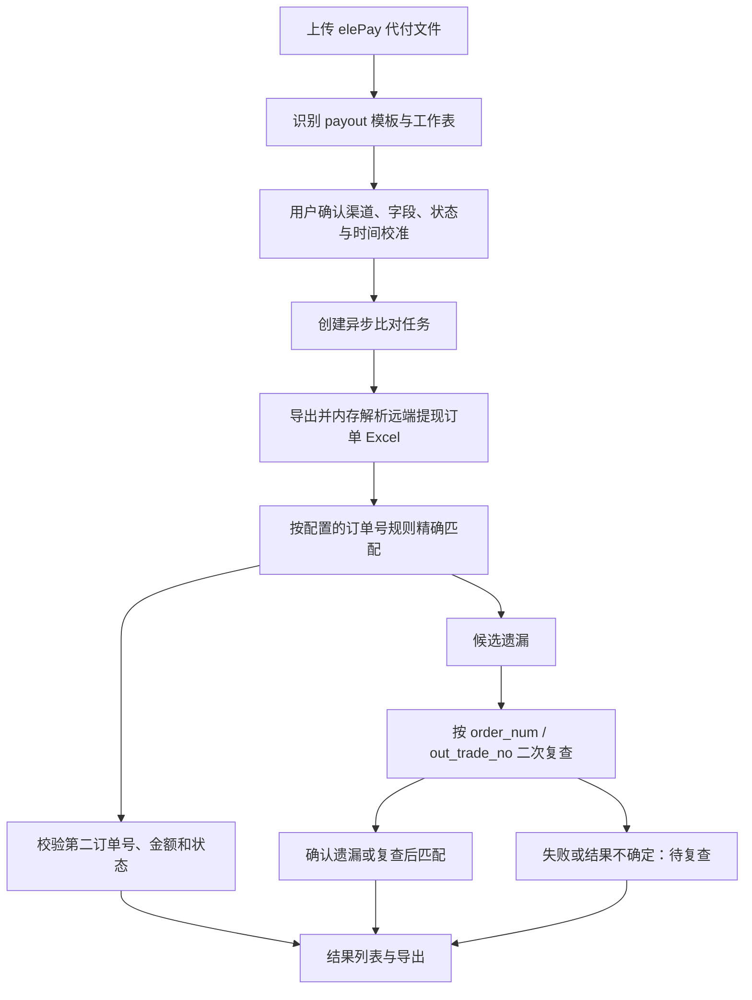

# 代付遗漏订单比对模块

> 文档状态：Draft v0.2
>
> 优先级：首批业务模块 / P0
>
> 日期：2026-07-25

## 0. 当前提现订单缓存基线

提现订单页面的当前名称为“提现订单明细”。它与未来的代付遗漏比对共用只读远端来源和
状态字典，但日常刷新不再遍历远端分页列表：按盘口业务时区导出一个完整自然日的
`withdrawOrder/export` Excel，在内存完成严格白名单解析后缓存本地。

- 自动刷新：每日业务时区 `00:05:01`，默认导出前一天；系统配置可选择一次性的指定日期。
- 手动刷新：可选前天、昨天、今天，默认昨天。
- 页面与汇总：只查询本地缓存；导出失败、状态未知或表头不符合白名单时保留旧缓存。
- 数据最小化：银行卡、手机号、银行、IFSC、失败原因、IP、完整响应和原始 Excel 都不保存。

安全白名单、缓存字段、明细字段和渠道汇总计算见
[提现订单 Excel 导出字段映射核对表](提现订单字段对照表.md)。

## 1. 目标

将代付平台导出的订单与 RajWin、RajLuck 远端提现订单进行比对，识别：

- 代付平台与远端订单完全匹配；
- 订单号对应但金额、另一订单号或状态异常；
- 代付平台存在、远端初次未找到的候选遗漏；
- 经完整分页和二次精确复查后仍未找到的确认遗漏；
- 代付平台成功、远端存在但状态非成功；
- 代付回调状态异常。

本模块与充值遗漏比对共用批次、模板、匹配、复查、导出、保留和审计框架，但使用
提现端点、提现状态字典及独立事实表。系统仍为只读，不调用提现审核、锁单、解锁、
刷新订单或状态修改接口。

## 2. 当前样本

代付平台样本只用于本地联调与模板校准，不写入本文档中的真实订单、金额、行数或凭据。
典型字段：

```text
系统订单号
商户订单号
创建时间(IST)
金额
实付金额
状态
回调状态
回调次数
失败原因
UTR
费率(%)
手续费
固定手续费
总手续费
隐藏
延迟成功
成功时间(IST)
备注
```

当同一文件存在完整工作表和成功订单子集工作表时，模板只能选择完整工作表作为导入来源，
不得把子集工作表合并，以免重复计算。所有平台状态均参与比对。

## 3. 远端提现接口

只读端点：

```text
POST /api/operate/withdrawOrder/index
POST /api/operate/withdrawOrder/summary
POST /api/operate/withdrawOrder/export
GET  /api/operate/withdrawOrder/channelList
GET  /api/operate/withdrawOrder/payChannel
GET  /api/system/dataDict/list?code=withdraw_status
```

列表请求已观察到的筛选字段：

```text
page
pageSize
create_time
update_time
uid
channel
pay_channel
pay_channel_name
order_num
out_trade_no
status
is_first
recent
```

远端列表与 Excel 可能包含银行账户、姓名、手机号、银行、IFSC、失败原因和 IP 等敏感字段。
当前提现订单缓存解析器只允许提取已批准的订单匹配/分析字段，禁止把完整 `info` 对象、
原始 Excel 或任何无关 PII 发布到标准化层、页面、日志或导出。

## 4. 字段候选映射

| elePay 字段 | 远端候选字段 | 当前证据 | 状态 |
|---|---|---|---|
| `商户订单号` | `order_num` | 6587 条中有 6491 条符合远端 24 位 `YW` 订单号格式 | 高可信，仍需同日期精确匹配确认 |
| `系统订单号` | `out_trade_no` | 字段语义相符；当前远端待审核样本该字段为空 | 待同日期已出款样本确认 |
| `金额` | `amount` 或 `real_amount` | 字段语义不足以确定 | 必须校准 |
| `实付金额` | `real_amount` 或 `amount` | 字段语义不足以确定 | 必须校准 |
| `状态` | `status` | 双方枚举不同；参考系统中远端 `3=代付成功` | 分别保存并以运行时字典校验 |
| `回调状态` | 无固定直接字段 | 代付平台自身通知状态 | 独立展示和异常标识 |
| `UTR` | 暂无已验证字段 | 远端样本未确认 | 展示/导出，不作为默认匹配键 |
| `创建时间(IST)` | `create_time` 候选 | 需确认业务语义和时区 | 用户校准 |
| `成功时间(IST)` | `submit_time`、`update_time` 候选 | 需确认远端更新时间语义 | 用户校准 |

在获得同日期、相同渠道的已完成提现样本之前，不得把中可信或待确认映射发布为无需
确认的全局模板默认值。

## 5. 标准化模型

代付导入行：

```text
batch_id
row_number
provider_system_order_no
merchant_order_no
amount
actual_paid_amount
payment_status_raw
payment_status_group
callback_status_raw
callback_status_group
callback_count
failure_reason
utr
order_time
success_time
fee
total_fee
row_fingerprint
validation_status
```

远端提现订单缓存：

```text
source_id
remote_id
order_num
out_trade_no
amount
real_amount
fee
status
status_label
pay_channel
pay_channel_name
create_time
submit_time
update_time
is_first
channel
audit_admin
synced_at
```

该本地缓存不保存原始 Excel、完整远端响应或未批准列；刷新状态仅记录窗口、导出行数、
导入数、重复数和脱敏错误，以支持完整性判断。

明确不进入标准化层：

```text
bank_account
bank_name
bank_code
account_user
mobile
ip
完整 info 对象
```

## 6. 共用匹配流程



规则：

1. 所有字段有效的代付订单参与比对，不按状态提前过滤；
2. 至少一个订单标识必须执行精确匹配；
3. 金额、UTR 和时间不能作为唯一匹配键；
4. 初次未找到只能标记为候选遗漏；
5. 对每条候选遗漏按远端支持的 `order_num`、`out_trade_no` 等已配置订单标识调用接口精确查询；
6. 完整分页和所有适用的精确复查均成功且仍未找到后，才能标记确认遗漏；
7. 精确复查查到订单后重新校验第二订单号、金额、双方状态和回调状态；
8. 单条复查失败、响应不完整或结果冲突时标记“待复查”，不计入确认遗漏；
9. 远端分页或认证等批次级请求不完整时，整个批次禁止发布确认遗漏结论；
10. 业务字段完全相同的物理行合并为一个规范订单组，只执行一次比对并记录全部行号；
11. 任一非空订单标识相同但金额、平台状态、渠道或其他模板关键字段不一致时，
    标记 `duplicate_payment_conflict`，不进入自动遗漏判定。

## 7. 状态与主指标

共用比对结果状态：

```text
matched
matched_after_recheck
amount_mismatch
order_reference_conflict
remote_status_not_success
candidate_missing
confirmed_missing
recheck_inconclusive
duplicate_payment_conflict
invalid_payment_row
comparison_incomplete
```

完全重复不是互斥的比对结果状态，而是规范订单组的 `exact_duplicate` 附加分类。
该组只计数和比对一次，同时保留 `duplicate_count`、工作表名称和全部原始行号。

代付附加标识：

```text
callback_abnormal
delayed_success
provider_failure
provider_status_unknown
remote_status_unknown
```

顶部主指标：

```text
代付确认遗漏数 =
count(result_status = confirmed_missing
      and payment_status_group = success)
```

非成功和未知状态订单仍参与比对并保留在明细、分组和导出中，但不计入顶部主指标。

## 8. 渠道与时间校准

一个支付平台可对应多个提现支付渠道。渠道绑定按下列维度维护：

```text
platform_id
source_id
business_type = withdraw
remote pay_channel
remote pay_channel_name
可选商户或文件判别值
生效时间
```

用户在批次开始前确认：

- 从系统配置中已启用的盘口选择一个来源；
- 从所选来源的提现渠道字典中选择一个或多个 elePay 渠道；
- 使用的工作表；
- 订单号、金额和状态映射；
- 币种列；没有币种列时默认预填 `INR` 并由用户确认；
- 平台时间列、远端时间字段和时区；
- 远端查询窗口前后缓冲量。

系统用已经精确匹配的订单展示时间差和金额字段一致率，辅助用户完成校准。
模板可以推荐名称匹配的 elePay 渠道，但最终以用户本次选择为准。多选渠道时，系统
按自然日导出的远端提现订单保留每条订单的渠道代码和名称；后续比对按用户确认的渠道
从本地缓存筛选，而不是在页面加载时重复远端请求。
一个批次只绑定一个来源；同一文件需要与多个盘口比对时分别创建批次。
批次保存盘口业务时区、盘口币种和支付平台时间列时区快照。
盘口业务时区新建时默认预填 `Asia/Kolkata`，但批次使用管理员实际确认后的值。
文件币种未知时不得启动；文件币种与盘口币种不同时仍按订单号比对，但金额标记为
“未校验”，不执行汇率换算，也不产生金额不一致结论。

## 9. 数据表与 API

独立事实表：

```text
fact_withdraw_orders
```

共用表：

```text
payment_platforms
payment_template_versions
payment_channel_bindings
time_calibration_profiles
reconciliation_batches
payment_import_rows
order_reconciliation_results
export_jobs
```

共用 API，以 `business_type=payin|payout` 区分：

```text
POST /api/v1/order-reconciliation/batches
POST /api/v1/order-reconciliation/batches/{batch_id}/compare
GET  /api/v1/order-reconciliation/batches/{batch_id}
GET  /api/v1/order-reconciliation/batches/{batch_id}/results
POST /api/v1/order-reconciliation/batches/{batch_id}/exports
```

## 10. 页面与导出

代付批次出现在共用批次运行总览中；总览按执行版本统计状态、数量、耗时和失败分类，
不跨批次累加代付订单量、金额或确认遗漏数。

代付结果页复用共同比对图表：结果状态分布、支付平台状态与结果的堆叠柱状图、按用户
确认时间字段生成的趋势图，以及提现渠道对比图。图表筛选与明细表联动，图表只显示
聚合值，不展示订单号、UTR 或任何无关 PII。

结果列表至少展示：

```text
来源
支付平台
提现渠道代码及名称
商户订单号
系统订单号
远端 order_num
远端 out_trade_no
金额
实付金额
支付币种
盘口币种
金额校验状态
远端 amount
远端 real_amount
代付平台状态
远端状态
回调状态
UTR
平台创建时间
平台成功时间
远端创建/提交/更新时间
比对结果
异常标识
复查次数和最后复查时间
重复分类及次数
原始工作表及行号
重复冲突字段
```

列表和导出不得包含银行账户、姓名、手机号、IP 或完整远端响应。
重复数据冲突提供独立筛选和导出；完全重复组在业务结果中只输出一条，并附带重复证据。
默认完整批次 Excel 同样包含“汇总”“确认遗漏”“远端状态异常”“待复查”
“重复数据冲突”“全部明细”六个工作表；当前筛选结果可单独导出 UTF-8 CSV。
代付批次同样采用团队共享模型：所有登录用户可查看、重新比对和导出全部批次，
列表可按创建人筛选但不按创建人限制访问，每次操作记录实际操作者。
所有登录用户也可在二次确认后取消非终态代付批次；取消版本保留进度和脱敏诊断，
但不得发布确认遗漏结论或导出，后续重新比对创建新执行版本。
代付执行版本进入完成、失败、不完整或取消终态时，仅向本次创建人或重新比对发起人
发送持久化站内 Alert；其他用户仍通过共享列表查看，MVP 不发送邮件或 Telegram。

## 11. 保留策略

使用系统配置的当前默认值：

- 上传和导出文件默认 3 天；
- 比对批次及订单级结果默认 30 天；
- 远端提现订单原始记录和标准化缓存默认 30 天。

管理员可修改默认值；新建或再次引用时固化 `expires_at`。

## 12. 验收标准

- 能识别 `elePay(HX)三方代付.xlsx` 的两个工作表，默认只导入
  `need_send_orders`，不会重复导入 `Sheet1` 子集；
- `payout` 模板不能被充值比对误用；
- 用户可校准两类订单号、两类金额、状态和时间字段；
- 用户必须确认支付平台时间列时区；
- 文件无币种列时默认预填 `INR` 并要求用户确认，未知币种行阻止启动；
- 异币种订单仍执行订单号存在性与状态比对，但明确显示“金额未校验”；
- 同一 elePay 平台可绑定多个提现渠道；
- 远端提现 Excel 通过完整表头白名单、主键、状态和去重校验后才覆盖本地缓存；
- 已知匹配订单按配置规则正确匹配；
- 金额或第二订单号冲突不会被误判为完全匹配；
- 完全重复的代付行只生成一条业务结果，并保留出现次数和全部原始行号；
- 同订单号关键字段不一致时标记重复数据冲突，不生成遗漏结论；
- 相同文件和参数重复提交时提示已有批次；明确重新比对后创建新执行版本并刷新远端数据；
- 取消执行中的批次后能在安全检查点停止，保留进度但不输出确认遗漏；
- 执行版本终态只向本次发起人发送一次可离线补达的站内 Alert；
- 结果页图表、指标卡、明细表和导出在同一筛选下数量一致，且不泄露代付 PII；
- 共用批次页只展示运行图表，不跨代付批次汇总订单或遗漏业务指标；
- 默认 Excel 包含六个固定工作表，当前筛选结果支持 CSV；
- 候选遗漏经过二次精确复查后才能成为确认遗漏；
- 平台成功、远端状态非成功时标记为远端状态异常；
- 回调异常单独标识；
- 顶部确认遗漏数只统计平台成功订单；
- 页面和导出保留双方状态，不包含无关 PII；
- 远端分页不完整时不输出确认遗漏。

## 13. 联调待确认

1. `elePay.商户订单号` 与远端 `order_num` 的同日期精确匹配率；
2. `elePay.系统订单号` 是否对应远端 `out_trade_no`；
3. `金额`、`实付金额` 与远端 `amount`、`real_amount` 的正式映射；
4. elePay 成功、失败、处理中和回调状态的枚举；
5. 运行时 `withdraw_status` 字典是否仍为 `3=代付成功`；
6. RajWin、RajLuck 中 elePay 的提现渠道代码；
7. `创建时间(IST)`、`成功时间(IST)` 对应的远端时间字段。
