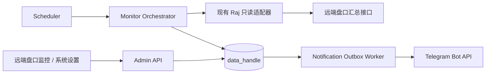

# Raj Data Handle「远端盘口监控」模块设计方案

## 1. 结论与命名

本项目中的现有“待处理提现监控”升级并统一命名为 **远端盘口监控**。新模块继续只读访问 RajWin / RajLuck 等远端盘口，周期性获取提现申请的两个独立指标：

- `pending_audit`：待审核，当前远端状态值为 `0`；
- `pending_review`：待审查，当前远端状态值为 `4`。

两个指标使用各自的阈值、恢复阈值和事件状态。任一指标达到告警条件时，系统向该盘口绑定的一个或多个 Telegram 群投递通知；持续超阈值时按冷却时间提醒，恢复后发送一次恢复通知。

首版不读取订单明细、不把远端响应写入订单缓存，也不实现审核、审查或任何其他远端写操作。

## 2. 当前实现与目标实现的差异

| 方面 | 当前实现 | 目标实现 |
| --- | --- | --- |
| 运行方式 | 仅在用户打开页面时，由浏览器定时请求 | `apps/worker` 中独立后台循环，页面关闭后仍持续运行 |
| 查询对象 | 所有已启用盘口，依次查询状态 `0`、`4` | 每盘口独立租约、独立超时、受控并发查询两个状态 |
| 参数 | 全局刷新间隔和全局印度日范围，暂借用旧提现刷新字段 | 专用全局设置 + 每盘口设置 + 每指标策略 |
| 状态 | 只返回本次查询结果 | 保存检查记录、当前状态、事件、峰值与恢复过程 |
| 通知 | 无 | Telegram Outbox、幂等键、重试、发送审计 |
| 故障语义 | `unavailable` / `failed` 仅页面显示 | 数据积压、源不可用、监控过期、投递失败分别处理 |
| 多副本 | 页面请求无调度防重 | PostgreSQL 行租约及唯一约束防止重复检查和重复通知 |

现有 `SourceConfig` 继续作为盘口主数据，现有统一远端账号及 `ANALYSIS_READ` 能力继续作为只读认证来源。不得新建第二套盘口、远端账号、凭据或会话主数据。

## 3. 配置归属

配置遵循“系统设置管理全局默认值、Telegram 目的地和模板；远端盘口监控管理每盘口及每指标策略”的边界。两个页面如展示同一字段，必须读写同一条配置记录，不能复制两份状态。

### 3.1 在“系统设置”中配置

#### A. 全局运行与默认策略

| 字段 | 建议默认值 | 说明 |
| --- | ---: | --- |
| `monitor_enabled` | `false` | 全局总开关；首次上线默认关闭 |
| `delivery_mode` | `record_only` | `record_only` 只产生日志和 Outbox 预览；灰度确认后切到 `telegram` |
| `dashboard_refresh_interval_seconds` | `30` | 仅控制前端状态刷新，不是后台检查周期 |
| `default_check_interval_seconds` | `60` | 新盘口策略的默认后台检查周期 |
| `source_request_timeout_seconds` | `15` | 单个盘口本次监控查询的总超时；与订单同步的 180 秒超时分离 |
| `default_breach_consecutive_checks` | `2` | 新策略默认连续超阈值次数 |
| `default_recovery_consecutive_checks` | `2` | 新策略默认连续恢复次数 |
| `source_failure_consecutive_checks` | `2` | 普通源错误连续达到该次数后才告警；鉴权失败立即告警 |
| `default_reminder_interval_minutes` | `10` | 业务积压持续提醒默认间隔 |
| `source_reminder_interval_minutes` | `15` | 源不可用持续提醒间隔 |
| `stale_after_multiplier` | `3` | 距最后一次成功检查超过 `检查周期 × 倍数` 时产生监控过期事件 |
| `notification_max_attempts` | `5` | Telegram 临时失败的最大投递次数 |
| `check_run_retention_days` | `30` | 检查记录保留期 |
| `notification_attempt_retention_days` | `90` | 通知尝试审计保留期 |

全局默认值只在新建盘口策略时复制为初值。以后修改默认值不追溯覆盖已配置盘口，避免一次全局保存意外改变所有盘口告警行为。如需批量变更，应提供有预览和二次确认的单独动作。

#### B. Telegram 目的地

在系统设置中集中维护可复用的 Telegram 目的地：

| 字段 | 说明 |
| --- | --- |
| `destination_id`、`display_name` | 稳定 ID 与群组展示名 |
| `enabled` | 是否允许新消息进入该目的地 Outbox |
| `bot_token_secret_ref` | 例如 `env://OPS_TELEGRAM_BOT_TOKEN`，只保存引用 |
| `chat_id_secret_ref` | 例如 `env://OPS_PRIMARY_CHAT_ID`，只保存引用 |
| `template_set_id` | 默认使用的模板集 |
| `parse_mode` | 首版固定为安全转义后的 HTML，禁用网页预览 |

Bot Token 和 Chat ID 的实际值只进入本机私有部署输入并被渲染到生产运行时环境；系统设置、接口响应、日志和数据库只保存引用及 `configured: true/false`。测试消息由管理员显式触发，写操作审计，但不改变真实事件和冷却时间。

#### C. 通知模板

模板在系统设置中按“模板集”集中维护，首版提供只读内置模板 `default-zh`，管理员可复制后编辑。一个模板集至少包含：

| 模板键 | 用途 |
| --- | --- |
| `threshold_opened` | 待审核或待审查首次超阈值 |
| `threshold_reminder` | 业务积压持续提醒 |
| `threshold_recovered` | 业务积压恢复 |
| `source_unavailable` | 远端查询连续失败或鉴权失败 |
| `source_reminder` | 源不可用持续提醒 |
| `source_recovered` | 远端查询恢复 |
| `monitor_stale` | 监控超过预期时间未完成 |
| `monitor_recovered` | 监控重新正常运行 |
| `test_message` | 管理员测试目的地 |

模板允许的变量采用白名单：

```text
{source_display_name} {source_id}
{metric_name} {metric_label} {metric_count}
{pending_audit_count} {pending_review_count}
{comparison_label} {threshold} {recovery_threshold}
{checked_at_local} {query_range_local}
{incident_id} {incident_started_at_local}
{incident_duration} {peak_count}
{error_code} {safe_error_message}
```

保存模板时即校验未知变量、长度和 HTML；业务值统一转义。通知不得包含订单号、玩家 UID、Cookie、Authorization、Token、密码或完整远端响应。

默认首次告警模板建议为：

```text
[远端盘口积压] {source_display_name}
指标：{metric_label}
当前数量：{metric_count}
告警条件：{comparison_label} {threshold}
检查时间：{checked_at_local}
查询范围：{query_range_local}
事件编号：{incident_id}
```

### 3.2 在“远端盘口监控”中配置

管理员在盘口卡片或配置抽屉中维护以下目标级设置：

| 分类 | 字段 | 说明 |
| --- | --- | --- |
| 调度 | `enabled` | 单独启停该盘口，不影响其他盘口 |
| 调度 | `check_interval_seconds` | 该盘口后台检查周期，建议 30–3600 秒 |
| 查询 | `query_window_mode` | `business_today` 或 `business_today_and_previous_days` |
| 查询 | `previous_days` | 仅后一模式使用；首版允许 `1` |
| 路由 | `destination_ids` | 绑定一个或多个系统设置中的 Telegram 目的地 |
| 覆盖 | `reminder_interval_minutes` | 可继承全局默认，也可按盘口覆盖 |
| 覆盖 | `source_failure_consecutive_checks` | 可继承全局默认，也可按盘口覆盖 |
| 覆盖 | `source_reminder_interval_minutes` | 可继承全局默认，也可按盘口覆盖 |

每个盘口的“待审核”和“待审查”分别设置：

| 字段 | 说明 |
| --- | --- |
| `metric_enabled` | 是否对该指标产生业务告警；关闭后仍可显示数量 |
| `comparison` | `gt`（大于）或 `gte`（大于等于） |
| `threshold` | 告警阈值，非负整数 |
| `recovery_threshold` | 恢复阈值，必须小于或等于告警阈值 |
| `breach_consecutive_checks` | 连续超阈值多少次后打开事件 |
| `recovery_consecutive_checks` | 连续达到恢复条件多少次后关闭事件 |
| `reminder_interval_minutes` | 可继承盘口级或全局值，也可按指标覆盖 |

页面同时显示但不在此处维护的盘口主数据包括：展示名称、后台地址、业务时区、默认只读账号和能力状态。这些仍由“盘口配置/远端账号”维护，监控页只提供跳转。查询时间窗必须使用 `SourceConfig.business_timezone`，不能继续硬编码 `Asia/Kolkata`。

### 3.3 不放入业务设置页面的运行参数

以下参数属于部署和容量管理，应放在应用环境或部署 YAML 中，不允许普通管理员在线随意修改：

- Worker 总并发数；
- Scheduler 轮询频率；
- 数据库租约时长与 Worker 实例 ID；
- Telegram HTTP 连接池大小、基础退避和最大退避；
- 指标采集端口及健康检查参数。

首版建议 `worker_total_concurrency=4`、`scheduler_poll_seconds=5`。租约时长动态取 `max(2 × source_request_timeout_seconds, check_interval_seconds)`。

## 4. 业务规则与状态机

### 4.1 一次有效检查

同一盘口的一次检查需要同时成功取得状态 `0` 和状态 `4` 的可信总数，才形成一条有效样本并推进两个业务指标状态机。如果任一查询失败，本次检查归类为源失败；可以记录已经得到的诊断值，但不能以部分结果推进告警或恢复。

适配器必须验证总数为非负整数。缺少可信总数字段时返回 `INVALID_RESPONSE_CONTRACT`，不能用当前页条数或默认值 `0` 替代。

### 4.2 两个独立业务事件

默认判定：

```text
超阈值：count > threshold
恢复：count <= recovery_threshold
```

`pending_audit` 和 `pending_review` 分别经历 `normal → breach_pending → alerting → recovering → normal`。它们可以同时有开放事件，也可以独立恢复；通知幂等和冷却也按“盘口 + 指标 + 事件 + 目的地”计算。

### 4.3 源健康独立于业务积压

源健康使用 `healthy / failing / unavailable / recovering` 状态。源查询失败时：

- 不写虚假的 `0`；
- 不关闭已有待审核或待审查事件；
- 普通网络错误按连续失败次数去抖；
- `AUTH_FAILED` 立即打开高优先级源异常事件；
- 下一次完整成功检查后发送一次源恢复通知，再恢复业务状态机推进。

错误码至少包含 `CONNECT_TIMEOUT`、`READ_TIMEOUT`、`DNS_ERROR`、`AUTH_FAILED`、`RATE_LIMITED`、`REMOTE_5XX`、`INVALID_RESPONSE_CONTRACT` 和 `INTERNAL_ERROR`。

## 5. 架构与执行流程



实现位置建议：

- `apps/worker` 增加互相隔离的 Monitor Scheduler/Worker 与 Telegram Outbox Worker 循环；
- `packages/domain/services` 保存状态机、租约、适配器契约、模板和投递服务；
- `apps/api` 仅提供配置、状态、手动测试和历史查询，不承载定时循环；
- 每个到期盘口使用独立 `AsyncSession` 和独立异常边界，通过 `asyncio.Semaphore` 控制总并发；
- 获取租约和完成落库都使用短事务，远端 HTTP 调用期间不持有数据库行锁；
- 状态变化与 Outbox 插入在同一事务提交。

## 6. 数据模型

数据库迁移只新增表和索引，不修改或删除现有业务字段。

| 表 | 关键内容 |
| --- | --- |
| `remote_market_monitor_settings` | 单例全局设置、默认值、灰度模式、保留期、配置版本 |
| `remote_market_monitor_target_settings` | `source_id` 一对一、启停、周期、查询窗、源故障策略 |
| `remote_market_monitor_metric_policies` | `source_id + metric` 唯一，两个指标各自阈值、恢复和去抖策略 |
| `remote_market_monitor_target_destinations` | 盘口与 Telegram 目的地多对多绑定 |
| `remote_market_monitor_states` | 下次检查、租约、最后成功时间、源健康和连续失败计数 |
| `remote_market_monitor_check_runs` | 每次检查状态、两个计数、查询范围、耗时和脱敏错误 |
| `remote_market_monitor_incidents` | 事件类型、指标、开放/关闭、当前值、峰值、连续次数 |
| `monitor_notification_destinations` | 目的地及密钥引用，不保存解析后的密钥 |
| `monitor_notification_template_sets` | 模板集名称、各事件模板、版本 |
| `monitor_notification_outbox` | 消息快照、幂等键、可发送时间、租约和最终状态 |
| `monitor_notification_attempts` | 每次 HTTP 尝试、状态码、Telegram message ID 和脱敏错误 |

关键约束：

- `target_settings.source_id` 外键指向 `source_configs.source_id`，不复制盘口名称、地址、时区或账号；
- 同一 `source_id + metric + incident_type` 最多一个开放事件，使用 PostgreSQL 部分唯一索引；
- `outbox.idempotency_key` 使用唯一索引；
- 幂等键格式为 `{source_id}:{metric}:{incident_id}:{event_type}:{destination_id}:{bucket}`；
- 检查记录只保存标准化计数与脱敏元数据，不保存订单明细或远端原始响应；
- 删除盘口仍遵守现有主数据约束；有监控历史时只允许停用，不级联删除审计记录。

## 7. API 与页面方案

### 7.1 兼容与新接口

建议新增：

```http
GET   /api/v1/remote-market-monitor/overview
POST  /api/v1/remote-market-monitor/refresh
GET   /api/v1/remote-market-monitor/targets/{source_id}
PATCH /api/v1/remote-market-monitor/targets/{source_id}
POST  /api/v1/remote-market-monitor/targets/{source_id}/test-query
GET   /api/v1/remote-market-monitor/check-runs
GET   /api/v1/remote-market-monitor/incidents

GET   /api/v1/system-settings/remote-market-monitor
PATCH /api/v1/system-settings/remote-market-monitor
GET   /api/v1/system-settings/monitor-notification-destinations
POST  /api/v1/system-settings/monitor-notification-destinations
PATCH /api/v1/system-settings/monitor-notification-destinations/{destination_id}
POST  /api/v1/system-settings/monitor-notification-destinations/{destination_id}/test
GET   /api/v1/system-settings/monitor-notification-template-sets
POST  /api/v1/system-settings/monitor-notification-template-sets
PATCH /api/v1/system-settings/monitor-notification-template-sets/{template_set_id}
```

现有 `POST /api/v1/withdraw-orders/pending-monitor` 在过渡期保留为兼容查询，Web 改用新接口后标记废弃。手动刷新只产生独立 `manual` 检查记录，不推进真实告警连续次数和通知冷却；测试查询和测试通知同样不改变事件状态。

### 7.2 页面布局

“远端盘口监控”页面包含：

1. 顶部健康摘要：监控总开关、Telegram 投递模式、正常/告警/源异常盘口数、Outbox 堆积；
2. 盘口卡片：待审核、待审查、各自阈值与事件状态、最后成功时间、下次检查、最近安全错误；
3. 管理员配置抽屉：本节 3.2 的盘口级和指标级字段；
4. 最近事件与通知状态：支持按盘口、指标、事件类型和投递状态筛选；
5. “立即只读检查”操作；若需重新登录或测试连接，跳转到“远端账号”，不在监控页复制凭据操作。

系统设置增加三个区块：“远端盘口监控全局设置”“Telegram 通知目的地”“通知模板”。普通业务用户可查看监控状态，不可修改配置、测试目的地或查看密钥引用细节；现有角色模型下写操作统一要求 `admin`。

## 8. Telegram 可靠性与安全

- Telegram 发送只从 Outbox 领取，业务检查不直接发 HTTP；
- `429` 严格遵守 `Retry-After`，网络错误和 `5xx` 使用有限指数退避加抖动；
- 永久 `4xx` 将该投递标记为人工处理，不阻塞同事件的其他群；
- 同一事件的不同群分别计算状态、重试和冷却；
- `DELIVERY_FAILED` 记录为平台异常并显示在页面，不能尝试向同一个失败目的地自我告警；
- 日志仅记录 `source_id`、`check_run_id`、`incident_id`、`outbox_id`，不记录 Telegram 请求 URL；
- 所有配置修改、测试查询、测试消息、启停和批量应用均写 `security_audit_logs`。

## 9. 分阶段实施与迁移

### 阶段 0：本次命名调整

- 菜单、页面标题和系统设置区块改为“远端盘口监控”；
- 新路由使用 `/remote-market-monitor`，旧 `/withdraw-pending-monitor` 永久重定向，避免旧书签失效；
- 内部 Python/TypeScript 类型和旧 API 暂不重命名，避免把纯 UI 改名扩大为不必要的兼容风险。

### 阶段 1：核心状态与只记录模式

- 新增兼容性数据库迁移、ORM、Schema、Fake Adapter 和状态机测试；
- 复用现有统一只读账号解析和远端会话；
- Worker 后台运行但 `delivery_mode=record_only`；
- 以当前系统设置中的 60 秒/印度日范围为种子，给已有启用盘口生成专用配置；不删除旧字段。

### 阶段 2：Telegram 与管理配置

- 完成密钥引用解析、目的地、模板、Outbox、重试和审计；
- 完成新 API 和页面配置抽屉；
- 在测试群验证首次告警、提醒、恢复、源异常和源恢复。

### 阶段 3：灰度与切换

- 单盘口只记录运行至少 24 小时，与当前页面人工查询核对；
- 单测试群开启真实发送，先关闭持续提醒；
- 验证恢复、Worker 重启和双副本竞争后，再逐盘口启用；
- Web 切换到新 overview API，旧接口保留一个发布周期后再评估移除。

生产数据库结构迁移和应用发布必须分开执行。实际运行迁移前仍需由用户明确确认目标环境、RDS 备份、回退方案、风险和执行窗口，并且只能使用本项目发布脚本；本设计本身不构成生产执行授权。

## 10. 验收重点

1. RajWin、RajLuck 可分别设置两个指标的阈值、恢复阈值、周期、时间窗和群路由。
2. 一个盘口超时不阻塞其他盘口超过一个检查周期。
3. 两个指标分别开关事件；一个恢复不会关闭另一个。
4. 源失败不写 `0`、不关闭业务事件，并能独立发送源恢复通知。
5. 多 Worker 竞争不会重复检查、重复开事件或重复创建同一 Outbox 消息。
6. Worker 重启后可以从数据库租约和 Outbox 恢复。
7. 一个 Telegram 群失败不阻塞其他群，`429` 和临时错误按策略重试。
8. GET 接口、日志、模板预览和审计记录中均无明文凭据。
9. 页面关闭后监控仍运行；页面刷新间隔不会改变后台检查周期。
10. 全部远端调用仅使用明确具备分析只读能力的统一账号，不触发任何远端写接口。

## 11. 实施前仍需业务确认的值

设计与 Fake Adapter 开发不依赖以下答案，但接入真实 Telegram 和设置首批策略前必须确认：

- RajWin、RajLuck 各自待审核/待审查的初始阈值和恢复阈值；
- 超阈值采用 `>` 还是 `>=`；
- 是否连续两次才告警，还是首次发现立即告警；
- 各盘口检查周期、查询日范围和持续提醒间隔；
- 每个盘口绑定哪些 Telegram 群，以及密钥引用名称；
- 源异常是否发送到同一群，还是单独的技术值班群；
- 灰度期 `record_only` 的开始时间和至少 24 小时的核对负责人。
